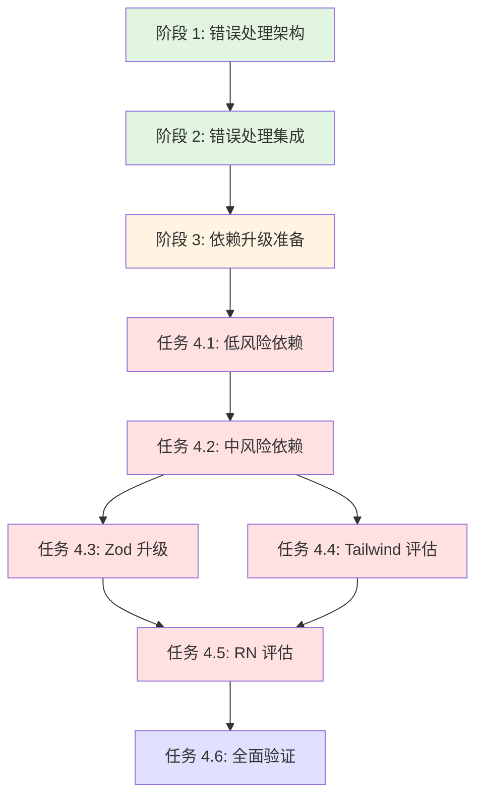

# 项目任务分解规划

## 已明确的决策

- **技术栈基础**：React Native 0.81.5 + Expo 54 + TypeScript 5.9.2
- **UI 框架**：React Native Paper 5.14.5 (Material Design 3)
- **数据存储**：Expo SQLite（已有完整的 Repository 模式）
- **日志系统**：已统一使用 `utils/logger.ts`，禁用直接 console.*
- **弹窗系统**：已建立统一的 ConfirmDialog + InputDialog
- **错误基础**：`services/ai/utils/errors.ts` 已定义部分错误类型（AiError、ImageGenerationError、NetworkError）
- **依赖管理工具**：npm
- **现有错误处理模式**：基础的 try-catch + useState(error)

## 整体规划概述

### 项目目标

1. **建立统一的错误处理机制**：
   - 创建企业级的错误分类体系和处理流程
   - 提供用户友好的错误提示和自动恢复能力
   - 集成错误日志记录和上报系统
   - 确保全局错误边界覆盖所有关键页面

2. **安全升级项目依赖**：
   - 识别并升级过时的依赖包（20 个包需要更新）
   - 处理重大版本变更（tailwindcss 3→4, zod 3→4, marked 16→17, react 19.1→19.2）
   - 验证跨平台兼容性（iOS/Android/Web）
   - 确保升级后功能完整性和性能稳定

### 技术栈

- **错误边界**：React Error Boundary + Expo ErrorRecovery
- **错误上报**：集成 Sentry（可选）或扩展现有 logger
- **类型定义**：TypeScript 严格模式 + Zod 数据验证
- **测试工具**：Jest + React Native Testing Library（推荐新增）
- **依赖分析**：npm-check-updates, depcheck

### 主要阶段

1. **阶段 1：错误处理架构设计与基础设施搭建**（预估 3-4 天）
2. **阶段 2：错误处理机制全面集成**（预估 4-5 天）
3. **阶段 3：依赖升级准备与风险评估**（预估 2-3 天）
4. **阶段 4：渐进式依赖升级与验证**（预估 5-6 天）

## 详细任务分解

### 阶段 1：错误处理架构设计与基础设施搭建

#### 任务 1.1：扩展错误类型系统

- **目标**：基于现有 `services/ai/utils/errors.ts`，建立完整的错误分类体系
- **输入**：
  - 现有错误类型定义（AiError、ImageGenerationError、NetworkError）
  - 项目中所有 try-catch 代码模式分析
  - 业务场景梳理（数据库、网络、权限、业务逻辑等）
- **输出**：
  - 扩展的 `utils/errors.ts` 文件，包含以下错误类：
    - `DatabaseError`（SQLite 操作错误）
    - `ValidationError`（数据验证错误）
    - `PermissionError`（权限错误，如麦克风、存储）
    - `ApiError`（统一 API 错误，替代 NetworkError）
    - `TimeoutError`（超时错误）
    - `BusinessError`（业务逻辑错误）
    - `UnknownError`（未知错误兜底）
  - 错误码枚举定义（ErrorCode enum）
  - 统一的错误转换函数 `normalizeError(error: unknown): AppError`
- **涉及文件**：
  - 新建：`utils/errors.ts`（移动并扩展 services/ai/utils/errors.ts）
  - 新建：`utils/error-codes.ts`（错误码常量）
  - 新建：`types/error.ts`（错误类型定义）
- **预估工作量**：6-8 小时

#### 任务 1.2：创建全局错误边界组件

- **目标**：捕获 React 组件树中的未捕获错误，提供降级 UI
- **输入**：
  - React Error Boundary API 文档
  - 现有的 `app/_layout.tsx` 结构
  - 设计稿：错误页面 UI（可复用 ConfirmDialog 样式）
- **输出**：
  - `components/common/ErrorBoundary.tsx` 组件
    - 支持错误日志记录（集成 logger）
    - 提供友好的错误页面（显示错误信息 + 重试按钮）
    - 支持错误上报（预留 Sentry 接口）
    - 支持不同级别的边界（页面级、模块级）
  - 在 `app/_layout.tsx` 中集成根级错误边界
  - 在关键页面（聊天页、设置页）集成页面级错误边界
- **涉及文件**：
  - 新建：`components/common/ErrorBoundary.tsx`
  - 修改：`app/_layout.tsx`
  - 修改：`app/index.tsx`（聊天主页）
  - 修改：`app/settings/index.tsx`
- **预估工作量**：8-10 小时

#### 任务 1.3：扩展日志系统支持错误追踪

- **目标**：在现有 logger 基础上添加错误追踪能力
- **输入**：
  - 现有的 `utils/logger.ts`
  - Sentry SDK 文档（可选）
  - 错误上报需求（堆栈、用户环境、操作路径）
- **输出**：
  - 扩展 `logger.error()` 方法，支持：
    - 自动捕获错误堆栈
    - 记录用户环境信息（设备、系统版本、应用版本）
    - 记录错误上下文（当前路由、用户操作）
    - 支持错误分组和去重
  - 新增 `logger.captureException(error: Error, context?: object)` 方法
  - 预留 Sentry 集成接口（`ErrorReporter` 抽象类）
  - 添加本地错误日志持久化（可选，存入 SQLite）
- **涉及文件**：
  - 修改：`utils/logger.ts`
  - 新建：`utils/error-reporter.ts`（错误上报抽象接口）
  - 新建：`utils/error-context.ts`（错误上下文收集）
- **预估工作量**：6-8 小时

#### 任务 1.4：创建统一的错误提示 UI 组件

- **目标**：基于现有 ConfirmDialog，创建专用的错误提示组件
- **输入**：
  - 现有的 `components/common/ConfirmDialog.tsx`
  - 错误类型定义（getUserMessage() 方法）
  - Material Design 3 错误提示规范
- **输出**：
  - `components/common/ErrorDialog.tsx` 组件
    - 自动根据错误类型选择图标和颜色
    - 支持可选的"详情"按钮（显示技术细节）
    - 支持自定义操作按钮（重试、忽略、反馈等）
    - 支持自动消失（Toast 模式）
  - 扩展 `use-confirm-dialog` Hook，新增 `showError(error: AppError)` 方法
  - 创建全局错误处理 Hook：`use-error-handler`
- **涉及文件**：
  - 新建：`components/common/ErrorDialog.tsx`
  - 修改：`hooks/use-confirm-dialog.tsx`
  - 新建：`hooks/use-error-handler.ts`
- **预估工作量**：6-8 小时

---

### 阶段 2：错误处理机制全面集成

#### 任务 2.1：数据库操作错误处理标准化

- **目标**：在所有 Repository 层统一错误处理
- **输入**：
  - `storage/repositories/` 下的所有文件（12 个文件）
  - SQLite 错误类型分析
  - 数据库迁移错误处理
- **输出**：
  - 创建 `DatabaseError` 包装器，自动转换 SQLite 错误
  - 在所有 Repository 方法中添加 try-catch
  - 统一事务错误处理（回滚 + 日志）
  - 数据库连接失败的降级策略
  - 单元测试：Repository 错误场景测试
- **涉及文件**：
  - 修改：`storage/repositories/*.ts`（17 个导出文件）
  - 修改：`storage/sqlite/db.ts`
  - 新建：`storage/sqlite/error-handler.ts`
- **预估工作量**：10-12 小时

#### 任务 2.2：AI 服务错误处理增强

- **目标**：优化现有 AI 服务的错误处理
- **输入**：
  - 现有的 `services/ai/AiClient.ts`
  - AI SDK 错误类型（anthropic、openai、google）
  - 网络超时、限流、认证失败等场景
- **输出**：
  - 扩展 `AiError`，支持重试机制
  - 添加智能降级（模型切换、提示词简化）
  - 统一流式响应的错误处理
  - MCP 工具调用错误处理
  - 添加错误恢复建议（如"检查 API 密钥"）
- **涉及文件**：
  - 修改：`services/ai/AiClient.ts`
  - 修改：`services/ai/utils/errors.ts`（合并到 utils/errors.ts）
  - 修改：`services/mcp/McpClient.ts`
  - 修改：`hooks/use-message-sender.ts`
- **预估工作量**：8-10 小时

#### 任务 2.3：网络请求错误处理统一化

- **目标**：建立统一的 HTTP 请求错误处理
- **输入**：
  - 现有的 `utils/http.ts`
  - 搜索服务（Bing、Google、Tavily）
  - 图片生成服务
  - MCP 服务
- **输出**：
  - 扩展 `utils/http.ts`，添加：
    - 自动重试机制（指数退避）
    - 超时处理（可配置）
    - 网络状态检测
    - 请求取消支持（AbortController）
  - 统一的 HTTP 错误转换（状态码 → AppError）
  - 全局网络错误监听器
- **涉及文件**：
  - 修改：`utils/http.ts`
  - 修改：`services/search/SearchClient.ts`
  - 修改：`services/ai/image-generation/ImageGenerator.ts`
  - 新建：`utils/network-monitor.ts`
- **预估工作量**：8-10 小时

#### 任务 2.4：权限错误处理（麦克风、存储、相机）

- **目标**：优雅处理移动端权限拒绝场景
- **输入**：
  - `services/voice/VoiceRecognition.ts`
  - `expo-image-picker`、`expo-document-picker` 使用场景
  - Expo Permissions API
- **输出**：
  - 创建 `PermissionManager` 工具类
    - 统一的权限请求流程
    - 权限被拒后的引导 UI（跳转设置）
    - 权限状态缓存
  - 在语音输入、图片选择、文件选择中集成权限处理
  - 添加权限相关的错误提示
- **涉及文件**：
  - 新建：`utils/permission-manager.ts`
  - 修改：`services/voice/VoiceRecognition.ts`
  - 修改：`components/chat/input/VoiceInputButton.tsx`
  - 修改：`components/chat/input/AttachmentMenu.tsx`
- **预估工作量**：6-8 小时

#### 任务 2.5：全局错误处理 Hook 集成到关键页面

- **目标**：在所有 Hooks 和组件中使用统一的错误处理
- **输入**：
  - 新建的 `use-error-handler` Hook
  - 所有现有 Hooks（13 个文件）
  - 关键组件（ChatInput、MessageList 等）
- **输出**：
  - 在所有 Hooks 中替换原有的 `useState(error)` 为 `useErrorHandler()`
  - 统一错误提示展示逻辑
  - 添加错误恢复按钮（如"重新加载"）
  - 错误日志自动上报
- **涉及文件**：
  - 修改：`hooks/*.ts`（13 个文件）
  - 修改：`components/chat/input/ChatInput.tsx`
  - 修改：`components/chat/message/MessageList.tsx`
  - 修改：`app/index.tsx`
- **预估工作量**：10-12 小时

---

### 阶段 3：依赖升级准备与风险评估

#### 任务 3.1：依赖分析与分类

- **目标**：识别所有需要升级的依赖并评估风险
- **输入**：
  - `npm outdated` 输出（20 个过时依赖）
  - 各依赖的 CHANGELOG 和 Breaking Changes 文档
- **输出**：
  - 依赖升级分类表（Excel/Markdown）：
    - **低风险**（小版本升级，无 Breaking Changes）：
      - `@ai-sdk/*`（2.0.40→2.0.44 等）
      - `@react-navigation/native`（7.1.19→7.1.20）
      - `eslint`（9.39.0→9.39.1）
      - `react-native-reanimated`（4.1.3→4.1.5）
    - **中风险**（跨小版本，可能有 API 变化）：
      - `@shopify/flash-list`（2.0.2→2.2.0）
      - `react`（19.1.0→19.2.0）
      - `marked`（16.4.1→17.0.0）
    - **高风险**（跨大版本，必有 Breaking Changes）：
      - `zod`（3.25.76→4.1.12）
      - `tailwindcss`（3.4.18→4.1.17）
      - `react-native`（0.81.5→0.82.1）
  - Breaking Changes 详细文档（每个高风险依赖）
  - 升级顺序建议（按依赖关系排序）
- **涉及文件**：
  - 新建：`docs/DEPENDENCY_UPGRADE_PLAN.md`
  - 新建：`.upgrade-checklist.md`（升级检查清单）
- **预估工作量**：6-8 小时

#### 任务 3.2：创建升级测试套件

- **目标**：建立自动化测试，验证升级后功能完整性
- **输入**：
  - 核心功能列表（聊天、设置、语音、图片生成等）
  - 跨平台兼容性需求（iOS/Android/Web）
- **输出**：
  - 配置 Jest + React Native Testing Library
  - 编写关键功能的集成测试：
    - 数据库操作测试（CRUD）
    - AI 服务调用测试（mock）
    - UI 组件渲染测试
    - 路由导航测试
  - 配置 CI/CD 自动测试（可选）
  - 手动测试检查清单（Excel/Markdown）
- **涉及文件**：
  - 新建：`jest.config.js`
  - 新建：`__tests__/` 目录
  - 新建：`__tests__/integration/database.test.ts`
  - 新建：`__tests__/integration/ai-service.test.ts`
  - 新建：`__tests__/components/ChatInput.test.tsx`
  - 修改：`package.json`（添加测试脚本）
- **预估工作量**：12-16 小时

#### 任务 3.3：依赖冲突检测与解决

- **目标**：检测并解决依赖升级可能引起的冲突
- **输入**：
  - `package.json` 现有依赖
  - `npm ls` 依赖树
  - `depcheck` 分析结果
- **输出**：
  - 运行 `npm ls` 检测当前依赖冲突
  - 运行 `depcheck` 检测未使用的依赖
  - 分析 peer dependencies 兼容性
  - 制定冲突解决方案（使用 overrides 或降级）
  - 清理未使用的依赖
- **涉及文件**：
  - 修改：`package.json`（可能调整 overrides）
  - 新建：`docs/DEPENDENCY_CONFLICTS.md`
- **预估工作量**：4-6 小时

---

### 阶段 4：渐进式依赖升级与验证

#### 任务 4.1：升级低风险依赖（第一批）

- **目标**：先升级无 Breaking Changes 的小版本
- **输入**：
  - 任务 3.1 的低风险依赖列表
- **输出**：
  - 升级以下依赖（执行 `npm update`）：
    - `@ai-sdk/anthropic@^2.0.44`
    - `@ai-sdk/google@^2.0.32`
    - `@ai-sdk/openai@^2.0.67`
    - `@ai-sdk/openai-compatible@^1.0.27`
    - `@modelcontextprotocol/sdk@^1.22.0`
    - `@react-native-community/slider@^5.1.1`
    - `@react-navigation/native@^7.1.20`
    - `eslint@^9.39.1`
    - `react-native-reanimated@^4.1.5`
    - `react-native-webview@^13.16.0`
  - 运行完整测试套件
  - 在 iOS/Android/Web 三端验证核心功能
  - 更新 `package-lock.json`
- **涉及文件**：
  - 修改：`package.json`
  - 修改：`package-lock.json`
- **预估工作量**：4-6 小时

#### 任务 4.2：升级中风险依赖（第二批）

- **目标**：升级可能有 API 变化的依赖
- **输入**：
  - 任务 3.1 的中风险依赖列表
  - 各依赖的 Migration Guide
- **输出**：
  - **升级 `@shopify/flash-list@^2.2.0`**：
    - 阅读 2.0.2→2.2.0 CHANGELOG
    - 检查 MessageList 组件是否需要调整
    - 验证滚动性能
  - **升级 `react@^19.2.0`**：
    - 检查新的 React 19.2 特性
    - 验证所有组件兼容性
    - 测试 Hooks 行为
  - **升级 `marked@^17.0.0`**：
    - 阅读 Breaking Changes
    - 更新 MarkdownRenderer 代码（如有 API 变化）
    - 测试 Markdown 渲染
  - 运行完整测试套件
  - 三端验证
- **涉及文件**：
  - 修改：`package.json`
  - 可能修改：`components/chat/message/MarkdownRenderer.tsx`
  - 可能修改：`components/chat/message/MessageList.tsx`
- **预估工作量**：8-10 小时

#### 任务 4.3：升级 Zod（高风险，重点关注）

- **目标**：安全升级 Zod 3→4
- **输入**：
  - Zod 4.x Migration Guide
  - 项目中所有使用 Zod 的地方（搜索 `z.object`、`z.string` 等）
- **输出**：
  - **阅读 Breaking Changes**：
    - Schema 定义 API 变化
    - Error handling 变化
    - 新的类型推断规则
  - **代码迁移**：
    - 搜索所有 `import.*zod` 引用
    - 更新 Schema 定义语法
    - 更新错误处理逻辑
    - 更新类型推断代码
  - **测试验证**：
    - 运行所有使用 Zod 的模块测试
    - 验证表单验证功能
    - 验证 API 响应验证
  - **回退方案**：保留 Zod 3.x 备份
- **涉及文件**：
  - 修改：`package.json`
  - 搜索并修改所有包含 Zod 的文件（预估 10-15 个）
- **预估工作量**：10-12 小时

#### 任务 4.4：升级 Tailwind CSS（高风险，需谨慎）

- **目标**：评估是否升级 Tailwind 3→4
- **输入**：
  - Tailwind CSS 4.x Migration Guide
  - 项目中使用 NativeWind 的所有组件
- **输出**：
  - **风险评估**：
    - NativeWind 4.2.1 是否支持 Tailwind 4.x
    - Breaking Changes 对现有样式的影响
    - 性能提升 vs 迁移成本
  - **决策**：
    - **方案 A**（推荐）：暂时保持 Tailwind 3.4.18，等待 NativeWind 官方支持
    - **方案 B**：升级到 Tailwind 4.x，手动适配 NativeWind
  - 如选择方案 B：
    - 更新所有使用 Tailwind 类名的组件
    - 更新 `tailwind.config.js`
    - 验证样式渲染
- **涉及文件**：
  - 修改：`package.json`
  - 可能修改：`tailwind.config.js`
  - 可能修改：所有使用 className 的组件
- **预估工作量**：12-16 小时（如升级）/ 2 小时（如保持）

#### 任务 4.5：升级 React Native（高风险，最后执行）

- **目标**：评估是否升级 RN 0.81.5→0.82.1
- **输入**：
  - React Native 0.82 Release Notes
  - Expo 54 兼容性文档
- **输出**：
  - **兼容性检查**：
    - Expo 54 是否支持 RN 0.82.1
    - 所有原生模块（voice、image-picker 等）兼容性
    - 第三方库（Paper、Reanimated）兼容性
  - **决策**：
    - **方案 A**（推荐）：暂时保持 RN 0.81.5，等待 Expo 55 发布
    - **方案 B**：升级到 RN 0.82.1，承担兼容性风险
  - 如选择方案 B：
    - 更新原生代码（iOS/Android）
    - 重新编译原生模块
    - 三端完整测试
    - 性能基准测试
- **涉及文件**：
  - 修改：`package.json`
  - 可能修改：`android/`、`ios/` 原生代码
- **预估工作量**：16-20 小时（如升级）/ 2 小时（如保持）

#### 任务 4.6：升级后全面验证与性能测试

- **目标**：确保所有升级后的功能正常且性能稳定
- **输入**：
  - 所有已升级的依赖
  - 测试套件
  - 性能基准数据（升级前）
- **输出**：
  - **功能验证**（参考手动测试清单）：
    - ✅ 聊天发送和接收
    - ✅ 多模型切换
    - ✅ 语音输入
    - ✅ 图片生成和查看
    - ✅ 附件上传
    - ✅ 搜索功能
    - ✅ MCP 工具调用
    - ✅ 话题管理
    - ✅ 设置页面所有功能
    - ✅ 主题切换
    - ✅ 数据导入导出
  - **性能测试**：
    - 启动时间对比
    - 消息渲染性能（FlashList）
    - 内存使用对比
    - 包体积对比
  - **跨平台验证**：
    - iOS 真机测试
    - Android 真机测试
    - Web 浏览器测试
  - **回归测试**：运行完整自动化测试套件
- **涉及文件**：
  - 新建：`docs/UPGRADE_VERIFICATION_REPORT.md`
- **预估工作量**：8-10 小时

---

## 需要进一步明确的问题

### 问题 1：错误上报服务选型

当前项目缺少错误上报平台，需要选择合适的服务用于生产环境错误监控。

**推荐方案**：

- **方案 A：集成 Sentry**
  - ✅ 优点：成熟的 React Native 支持、免费额度充足、详细的错误堆栈和用户路径追踪
  - ❌ 缺点：需要注册账号、配置 DSN、增加包体积约 150KB
  - 📦 依赖：`@sentry/react-native`

- **方案 B：自建日志服务**
  - ✅ 优点：完全自主可控、无隐私风险、可集成现有 logger 系统
  - ❌ 缺点：需要后端服务支持、功能有限、开发成本高
  - 📦 依赖：无第三方依赖，需开发后端 API

- **方案 C：暂不集成，仅本地日志**
  - ✅ 优点：零成本、零依赖、开发速度快
  - ❌ 缺点：无法收集生产环境错误、依赖用户反馈

**等待用户选择**：

```
请选择您偏好的方案，或提供其他建议：
[ ] 方案 A - 集成 Sentry（推荐）
[ ] 方案 B - 自建日志服务
[ ] 方案 C - 暂不集成
[ ] 其他方案：_______________________
```

---

### 问题 2：Tailwind CSS 4.x 升级策略

Tailwind CSS 4.x 是重大版本升级，但 NativeWind 4.2.1 对其支持尚不明确。

**推荐方案**：

- **方案 A：保持 Tailwind 3.4.18（推荐）**
  - ✅ 优点：零风险、无需代码修改、NativeWind 完美兼容
  - ❌ 缺点：无法使用 Tailwind 4.x 新特性（性能优化、新 API）

- **方案 B：升级到 Tailwind 4.x**
  - ✅ 优点：使用最新特性、性能提升、为未来准备
  - ❌ 缺点：可能需要 fork NativeWind、大量样式调整、高风险

**等待用户选择**：

```
请选择您偏好的方案：
[ ] 方案 A - 保持 Tailwind 3.4.18（推荐）
[ ] 方案 B - 升级到 Tailwind 4.x
```

---

### 问题 3：React Native 0.82.1 升级策略

React Native 0.82.1 需要验证 Expo 54 兼容性。

**推荐方案**：

- **方案 A：保持 RN 0.81.5，等待 Expo 55（推荐）**
  - ✅ 优点：零风险、官方支持、所有依赖完美兼容
  - ❌ 缺点：无法使用 RN 0.82 新特性

- **方案 B：升级到 RN 0.82.1**
  - ✅ 优点：使用最新特性、性能提升
  - ❌ 缺点：可能与 Expo 54 不兼容、需要大量测试、原生模块可能需要重新编译

**等待用户选择**：

```
请选择您偏好的方案：
[ ] 方案 A - 保持 RN 0.81.5（推荐）
[ ] 方案 B - 升级到 RN 0.82.1
```

---

### 问题 4：Zod 4.x 升级策略

Zod 4.x 是重大版本升级，API 有较大变化。

**推荐方案**：

- **方案 A：升级到 Zod 4.x**
  - ✅ 优点：更好的类型推断、性能提升、更好的错误提示
  - ❌ 缺点：需要修改所有 Schema 定义、中等工作量

- **方案 B：保持 Zod 3.x**
  - ✅ 优点：零风险、无需代码修改
  - ❌ 缺点：无法使用新特性

**等待用户选择**：

```
请选择您偏好的方案：
[ ] 方案 A - 升级到 Zod 4.x
[ ] 方案 B - 保持 Zod 3.x
```

---

### 问题 5：是否引入自动化测试

当前项目无自动化测试，依赖升级风险较高。

**推荐方案**：

- **方案 A：建立完整的测试套件（推荐）**
  - ✅ 优点：验证升级安全性、防止未来回归、提升代码质量
  - ❌ 缺点：初期投入时间较大（12-16 小时）
  - 📦 依赖：`jest`, `@testing-library/react-native`

- **方案 B：仅建立关键路径测试**
  - ✅ 优点：投入时间较少（6-8 小时）、覆盖核心功能
  - ❌ 缺点：覆盖不全、风险仍然存在

- **方案 C：纯手动测试**
  - ✅ 优点：零开发成本
  - ❌ 缺点：耗时、易漏测、无法自动化

**等待用户选择**：

```
请选择您偏好的方案：
[ ] 方案 A - 建立完整的测试套件（推荐）
[ ] 方案 B - 仅建立关键路径测试
[ ] 方案 C - 纯手动测试
```

---

## 用户反馈区域

请在此区域补充您对整体规划的意见和建议：

```
用户补充内容：

---
1. 关于错误处理机制的优先级和范围调整
---
2. 关于依赖升级的风险偏好（保守 vs 激进）
---
3. 关于测试覆盖率的期望
---
4. 关于时间安排和里程碑
---
5. 其他建议和需求
---
```

---

## 附录：时间估算汇总

| 阶段 | 任务数 | 预估工作量（小时） | 预估天数 |
|------|--------|-------------------|----------|
| 阶段 1：错误处理架构设计 | 4 | 26-34 | 3-4 天 |
| 阶段 2：错误处理机制集成 | 5 | 42-52 | 4-5 天 |
| 阶段 3：依赖升级准备 | 3 | 22-30 | 2-3 天 |
| 阶段 4：渐进式依赖升级 | 6 | 46-74 | 5-8 天 |
| **总计** | **18** | **136-190** | **14-20 天** |

**注**：
- 以上为纯开发时间，不包括等待用户反馈、Code Review、文档编写等时间
- 实际时间可能因需求变更、技术难题等因素有所调整
- 建议采用敏捷迭代方式，每完成一个阶段进行评审和调整

---

## 附录：依赖关系图



---

## 附录:风险控制措施

| 风险类型 | 风险描述 | 缓解措施 | 应急方案 |
|---------|---------|---------|---------|
| **技术风险** | Zod 4.x API 变化导致大量代码失效 | 先在测试分支升级，充分测试后合并 | 回退到 Zod 3.x，延后升级 |
| **技术风险** | Tailwind 4.x 与 NativeWind 不兼容 | 升级前验证兼容性，参考社区反馈 | 保持 Tailwind 3.x |
| **技术风险** | RN 0.82 与 Expo 54 不兼容 | 查阅官方文档，咨询社区 | 保持 RN 0.81.5 |
| **进度风险** | 错误处理集成工作量超预期 | 采用渐进式实施，先覆盖核心模块 | 调整范围，仅覆盖关键路径 |
| **质量风险** | 依赖升级后出现隐藏 Bug | 建立完整测试套件，多轮验证 | 分批发布，快速回滚 |
| **兼容性风险** | iOS/Android/Web 表现不一致 | 三端并行测试，使用真机验证 | 针对性修复，必要时降级 |

---

**规划制定完成日期**：2025-11-16
**规划版本**：v1.0
**规划制定人**：Claude (AI 编程助手)