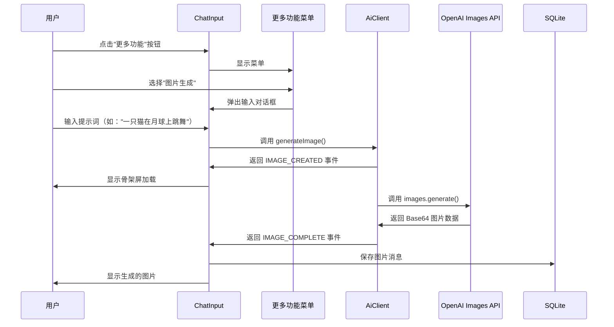

# 图片生成功能实施计划 🎨

> **规划时间**: 2025-11-09
> **规划者**: 猫娘工程师 幽浮喵
> **项目**: AetherLink_z
> **功能目标**: 集成图片生成功能，支持专用图像模型（DALL-E 3、GPT-Image-1 等），与聊天模型区分，参考 Cherry Studio 实现方式

---

## 📋 一、需求分析

### 1.1 核心需求

| 需求项 | 详细描述 | 优先级 |
|--------|---------|--------|
| **图片生成能力** | 支持文本到图片生成（Text-to-Image） | ⭐⭐⭐⭐⭐ |
| **模型区分** | 图片生成模型与聊天模型明确区分 | ⭐⭐⭐⭐⭐ |
| **UI 集成** | 在聊天输入框"更多功能"菜单中添加图片生成入口 | ⭐⭐⭐⭐⭐ |
| **官方 SDK** | 必须使用 Vercel AI SDK 官方实现 | ⭐⭐⭐⭐⭐ |
| **错误处理** | 完善的错误提示和用户反馈 | ⭐⭐⭐⭐ |
| **流式处理** | 图片生成进度指示（加载状态） | ⭐⭐⭐⭐ |
| **多模型支持** | OpenAI DALL-E 3、GPT-Image-1 等 | ⭐⭐⭐ |

### 1.2 参考案例

**Cherry Studio 实现亮点**:
1. ✅ 双轨制架构：专用图片生成模型 vs 对话式图片生成
2. ✅ 模型识别机制：通过 `isDedicatedImageGenerationModel()` 判断
3. ✅ 流式事件系统：`IMAGE_CREATED` → `IMAGE_COMPLETE`
4. ✅ 完善的错误处理：自定义 `ImageGenerationError` 类
5. ✅ UI 优雅集成：专用按钮 + 骨架屏加载

**AetherLink_z 现有优势**:
1. ✅ 已有完善的 AI 调用架构（`AiClient.ts`）
2. ✅ 已有流式响应机制（`streamCompletion`）
3. ✅ 已有附件存储系统（`AttachmentRepository`）
4. ✅ 已有思考链功能（可复用 Chunk 类型机制）
5. ✅ 已有"更多功能"菜单（易于扩展）

### 1.3 用户交互流程



---

## 🎯 二、技术方案设计

### 2.1 架构设计

#### 模块划分

```
┌─────────────────────────────────────────────┐
│   UI Layer                                  │
│   - MoreActionsMenu (添加图片生成入口)        │
│   - ImageGenerationDialog (输入提示词对话框)  │
│   - MessageBubble (显示生成的图片)            │
└─────────────────────────────────────────────┘
                    ↓
┌─────────────────────────────────────────────┐
│   Hooks Layer                               │
│   - useImageGeneration (图片生成逻辑封装)     │
└─────────────────────────────────────────────┘
                    ↓
┌─────────────────────────────────────────────┐
│   Service Layer                             │
│   - AiClient (扩展 generateImage 方法)       │
│   - ModelDiscovery (扩展图片模型识别)         │
└─────────────────────────────────────────────┘
                    ↓
┌─────────────────────────────────────────────┐
│   Data Layer                                │
│   - MessageRepository (保存图片消息)         │
│   - AttachmentRepository (保存图片文件)      │
└─────────────────────────────────────────────┘
```

#### 数据流设计

```typescript
// 1. 用户输入提示词
const prompt = "一只猫在月球上跳舞";

// 2. 调用图片生成服务
const result = await AiClient.generateImage({
  provider: 'openai',
  model: 'dall-e-3',
  prompt: prompt,
  onCreated: () => showLoadingSkeleton(),
  onComplete: (imageData) => saveAndDisplay(imageData),
  onError: (error) => showErrorAlert(error),
});

// 3. 保存到数据库
await MessageRepository.addMessage({
  conversationId: currentConvId,
  role: 'assistant',
  text: `[图片生成]\n提示词: ${prompt}`,
  attachmentIds: [savedImageId],
  extra: {
    type: 'image_generation',
    model: 'dall-e-3',
    provider: 'openai',
    prompt: prompt,
  }
});

// 4. UI 显示
<MessageBubble
  message={message}
  renderAttachment={(attachment) => (
    <GeneratedImageCard
      image={attachment}
      prompt={message.extra.prompt}
    />
  )}
/>
```

### 2.2 核心实现细节

#### 2.2.1 图片模型识别

**文件**: `services/ai/ModelDiscovery.ts`

```typescript
/**
 * 专用图片生成模型列表
 * 这些模型必须使用 Images API 而非 Chat Completions API
 */
export const DEDICATED_IMAGE_MODELS = [
  'dall-e-3',
  'dall-e-2',
  'gpt-image-1',
  'grok-2-image',
  'grok-2-image-1212',
  'grok-2-image-latest',
] as const;

/**
 * 判断是否为专用图片生成模型
 */
export function isDedicatedImageGenerationModel(model: string): boolean {
  const modelLower = model.toLowerCase();
  return DEDICATED_IMAGE_MODELS.some(m => modelLower.includes(m));
}

/**
 * 判断模型是否支持图片生成（包括对话式生成）
 */
export function supportsImageGeneration(provider: string, model: string): boolean {
  // 1. 专用图片生成模型
  if (isDedicatedImageGenerationModel(model)) {
    return true;
  }

  // 2. Gemini 图片生成模型
  if (provider === 'google' && /gemini.*image/i.test(model)) {
    return true;
  }

  // 3. 未来扩展其他对话式图片生成模型
  return false;
}
```

#### 2.2.2 AI 客户端扩展

**文件**: `services/ai/AiClient.ts`

```typescript
import { experimental_generateImage as generateImage } from 'ai';
import { openai } from '@ai-sdk/openai';
import { anthropic } from '@ai-sdk/anthropic';

// 新增：图片生成选项接口
export interface GenerateImageOptions {
  provider: string;
  model: string;
  prompt: string;
  n?: number; // 生成数量（默认 1）
  size?: '1024x1024' | '1792x1024' | '1024x1792'; // 图片尺寸
  quality?: 'standard' | 'hd'; // 图片质量（仅 DALL-E 3）
  style?: 'vivid' | 'natural'; // 风格（仅 DALL-E 3）
  abortSignal?: AbortSignal;

  // 流式回调
  onCreated?: () => void;
  onProgress?: (progress: number) => void; // 进度（0-100）
  onComplete?: (imageData: ImageGenerationResult) => void;
  onError?: (error: Error) => void;
}

// 新增：图片生成结果接口
export interface ImageGenerationResult {
  type: 'url' | 'base64';
  images: string[]; // URL 列表或 Base64 数据
  revisedPrompt?: string; // DALL-E 3 返回的优化后提示词
  usage?: {
    totalTokens?: number;
  };
}

// 新增：图片生成错误类
export class ImageGenerationError extends Error {
  constructor(
    message: string,
    public provider?: string,
    public model?: string,
    public cause?: Error
  ) {
    super(message);
    this.name = 'ImageGenerationError';
  }
}

/**
 * 生成图片（使用 Vercel AI SDK 官方 API）
 */
export async function generateImageWithAI(
  options: GenerateImageOptions
): Promise<ImageGenerationResult> {
  const {
    provider,
    model,
    prompt,
    n = 1,
    size = '1024x1024',
    quality = 'standard',
    style = 'vivid',
    abortSignal,
    onCreated,
    onComplete,
    onError,
  } = options;

  try {
    // 1. 验证模型支持
    if (!isDedicatedImageGenerationModel(model)) {
      throw new ImageGenerationError(
        `模型 ${model} 不支持图片生成功能`,
        provider,
        model
      );
    }

    // 2. 验证提示词
    if (!prompt || prompt.trim().length === 0) {
      throw new ImageGenerationError(
        '请输入图片描述提示词',
        provider,
        model
      );
    }

    // 3. 发送创建事件
    onCreated?.();

    // 4. 获取 AI SDK 提供商实例
    const providerInstance = getProviderInstance(provider, model);

    // 5. 调用 Vercel AI SDK 官方 API
    const result = await generateImage({
      model: providerInstance,
      prompt: prompt,
      n: n,
      size: size,
      ...(model.includes('dall-e-3') && {
        // DALL-E 3 专属参数
        quality: quality,
        style: style,
      }),
      abortSignal: abortSignal,
    });

    // 6. 处理返回结果
    const imageData: ImageGenerationResult = {
      type: 'base64', // 默认使用 Base64
      images: result.images || [],
      revisedPrompt: result.revisedPrompt,
      usage: result.usage,
    };

    // 7. 发送完成事件
    onComplete?.(imageData);

    return imageData;
  } catch (error: any) {
    // 错误处理
    const imageError = new ImageGenerationError(
      error.message || '图片生成失败',
      provider,
      model,
      error
    );

    onError?.(imageError);
    throw imageError;
  }
}

/**
 * 获取 AI SDK 提供商实例
 */
function getProviderInstance(provider: string, model: string) {
  switch (provider) {
    case 'openai':
      return openai(model);
    case 'anthropic':
      return anthropic(model);
    // 未来扩展其他提供商
    default:
      throw new ImageGenerationError(
        `不支持的图片生成提供商: ${provider}`,
        provider,
        model
      );
  }
}
```

#### 2.2.3 自定义 Hook

**文件**: `hooks/use-image-generation.ts`

```typescript
import { useState, useCallback } from 'react';
import { generateImageWithAI, GenerateImageOptions, ImageGenerationResult } from '@/services/ai/AiClient';
import { MessageRepository } from '@/storage/repositories/messages';
import { AttachmentRepository } from '@/storage/repositories/attachments';
import * as FileSystem from 'expo-file-system';
import { decode as base64Decode } from 'base-64';

export interface UseImageGenerationOptions {
  conversationId?: string;
  provider: string;
  model: string;
}

export function useImageGeneration(options: UseImageGenerationOptions) {
  const { conversationId, provider, model } = options;

  const [isGenerating, setIsGenerating] = useState(false);
  const [progress, setProgress] = useState(0);
  const [error, setError] = useState<Error | null>(null);

  /**
   * 生成图片
   */
  const generateImage = useCallback(async (prompt: string) => {
    if (!conversationId) {
      throw new Error('请先创建或选择对话');
    }

    setIsGenerating(true);
    setProgress(0);
    setError(null);

    try {
      // 1. 调用 AI 服务
      const result = await generateImageWithAI({
        provider,
        model,
        prompt,
        onCreated: () => setProgress(10),
        onProgress: (p) => setProgress(p),
        onComplete: async (imageData: ImageGenerationResult) => {
          setProgress(90);

          // 2. 保存图片到本地
          const savedAttachments = await saveImages(imageData.images);

          // 3. 保存消息到数据库
          await MessageRepository.addMessage({
            conversationId,
            role: 'assistant',
            text: imageData.revisedPrompt
              ? `[图片生成]\n原提示词: ${prompt}\n优化后: ${imageData.revisedPrompt}`
              : `[图片生成]\n提示词: ${prompt}`,
            attachmentIds: savedAttachments.map(a => a.id),
            extra: {
              type: 'image_generation',
              model,
              provider,
              prompt,
              revisedPrompt: imageData.revisedPrompt,
              size: '1024x1024',
            }
          });

          setProgress(100);
        },
        onError: (err) => {
          setError(err);
        },
      });

      return result;
    } catch (err: any) {
      setError(err);
      throw err;
    } finally {
      setIsGenerating(false);
      setTimeout(() => setProgress(0), 1000);
    }
  }, [conversationId, provider, model]);

  /**
   * 保存 Base64 图片到本地
   */
  const saveImages = async (base64Images: string[]): Promise<Attachment[]> => {
    const savedAttachments: Attachment[] = [];

    for (const base64Data of base64Images) {
      // 移除 data:image/png;base64, 前缀
      const pureBase64 = base64Data.replace(/^data:image\/\w+;base64,/, '');

      // 生成文件路径
      const fileName = `generated_${Date.now()}_${Math.random().toString(36).slice(2)}.png`;
      const fileUri = `${FileSystem.documentDirectory}${fileName}`;

      // 写入文件
      await FileSystem.writeAsStringAsync(fileUri, pureBase64, {
        encoding: FileSystem.EncodingType.Base64,
      });

      // 获取文件信息
      const fileInfo = await FileSystem.getInfoAsync(fileUri);

      // 保存到附件表
      const attachment = await AttachmentRepository.create({
        type: 'image',
        mime: 'image/png',
        uri: fileUri,
        size: fileInfo.size || 0,
        name: fileName,
        extra: {
          source: 'ai_generated',
        }
      });

      savedAttachments.push(attachment);
    }

    return savedAttachments;
  };

  return {
    generateImage,
    isGenerating,
    progress,
    error,
  };
}
```

#### 2.2.4 UI 组件设计

##### 更多功能菜单扩展

**文件**: `components/chat/MoreActionsMenu.tsx`

```typescript
// 在现有菜单项中添加
const menuItems = [
  // ...现有菜单项
  {
    id: 'image-generation',
    title: '图片生成',
    description: '使用 AI 生成图片（需支持的模型）',
    icon: 'image-plus', // Material Community Icons
    color: '#F59E0B', // 橙色
    onPress: handleImageGeneration,
    disabled: !supportsImageGeneration(provider, model), // 动态禁用
  },
];

const handleImageGeneration = () => {
  onClose(); // 关闭菜单
  showImageGenerationDialog(); // 显示输入对话框
};
```

##### 图片生成输入对话框

**文件**: `components/chat/ImageGenerationDialog.tsx`

```typescript
import React, { useState } from 'react';
import { Modal, View, StyleSheet } from 'react-native';
import { TextInput, Button, Text, ActivityIndicator } from 'react-native-paper';
import { useImageGeneration } from '@/hooks/use-image-generation';
import { useConfirmDialog } from '@/hooks/use-confirm-dialog';

interface Props {
  visible: boolean;
  onDismiss: () => void;
  conversationId?: string;
  provider: string;
  model: string;
}

export function ImageGenerationDialog(props: Props) {
  const { visible, onDismiss, conversationId, provider, model } = props;

  const [prompt, setPrompt] = useState('');
  const { generateImage, isGenerating, progress, error } = useImageGeneration({
    conversationId,
    provider,
    model,
  });
  const { showAlert } = useConfirmDialog();

  const handleGenerate = async () => {
    if (!prompt.trim()) {
      showAlert('提示', '请输入图片描述');
      return;
    }

    try {
      await generateImage(prompt);
      setPrompt(''); // 清空输入
      onDismiss(); // 关闭对话框
    } catch (err: any) {
      showAlert('图片生成失败', err.message || '未知错误');
    }
  };

  return (
    <Modal
      visible={visible}
      onDismiss={onDismiss}
      transparent
      animationType="slide"
    >
      <View style={styles.container}>
        <View style={styles.dialog}>
          <Text variant="headlineSmall" style={styles.title}>
            AI 图片生成
          </Text>

          <TextInput
            label="请描述你想要的图片"
            value={prompt}
            onChangeText={setPrompt}
            multiline
            numberOfLines={4}
            placeholder="例如：一只可爱的橘猫坐在月球上，背景是璀璨的星空..."
            disabled={isGenerating}
            style={styles.input}
          />

          {isGenerating && (
            <View style={styles.progressContainer}>
              <ActivityIndicator animating size="small" />
              <Text variant="bodySmall" style={styles.progressText}>
                生成中... {progress}%
              </Text>
            </View>
          )}

          {error && (
            <Text variant="bodySmall" style={styles.errorText}>
              ❌ {error.message}
            </Text>
          )}

          <View style={styles.actions}>
            <Button
              mode="outlined"
              onPress={onDismiss}
              disabled={isGenerating}
            >
              取消
            </Button>
            <Button
              mode="contained"
              onPress={handleGenerate}
              disabled={isGenerating || !prompt.trim()}
              loading={isGenerating}
            >
              生成
            </Button>
          </View>
        </View>
      </View>
    </Modal>
  );
}

const styles = StyleSheet.create({
  container: {
    flex: 1,
    justifyContent: 'center',
    alignItems: 'center',
    backgroundColor: 'rgba(0, 0, 0, 0.5)',
  },
  dialog: {
    width: '85%',
    backgroundColor: 'white',
    borderRadius: 16,
    padding: 20,
    shadowColor: '#000',
    shadowOffset: { width: 0, height: 4 },
    shadowOpacity: 0.3,
    shadowRadius: 8,
    elevation: 8,
  },
  title: {
    marginBottom: 16,
    textAlign: 'center',
  },
  input: {
    marginBottom: 12,
  },
  progressContainer: {
    flexDirection: 'row',
    alignItems: 'center',
    marginBottom: 12,
  },
  progressText: {
    marginLeft: 8,
    color: '#6B7280',
  },
  errorText: {
    color: '#EF4444',
    marginBottom: 12,
  },
  actions: {
    flexDirection: 'row',
    justifyContent: 'flex-end',
    gap: 8,
  },
});
```

##### 生成图片消息卡片

**文件**: `components/chat/GeneratedImageCard.tsx`

```typescript
import React from 'react';
import { View, Image, StyleSheet, TouchableOpacity } from 'react-native';
import { Text, Chip } from 'react-native-paper';
import { Attachment } from '@/storage/core';

interface Props {
  attachment: Attachment;
  prompt: string;
  revisedPrompt?: string;
  onPress?: () => void; // 点击查看大图
}

export function GeneratedImageCard(props: Props) {
  const { attachment, prompt, revisedPrompt, onPress } = props;

  return (
    <View style={styles.container}>
      {/* 图片 */}
      <TouchableOpacity onPress={onPress} activeOpacity={0.8}>
        <Image
          source={{ uri: attachment.uri }}
          style={styles.image}
          resizeMode="cover"
        />
      </TouchableOpacity>

      {/* 提示词信息 */}
      <View style={styles.infoContainer}>
        <Chip icon="text-box" compact style={styles.chip}>
          AI 生成
        </Chip>

        <Text variant="bodySmall" style={styles.promptLabel}>
          提示词:
        </Text>
        <Text variant="bodyMedium" style={styles.promptText}>
          {prompt}
        </Text>

        {revisedPrompt && (
          <>
            <Text variant="bodySmall" style={styles.promptLabel}>
              AI 优化后:
            </Text>
            <Text variant="bodySmedium" style={styles.revisedPromptText}>
              {revisedPrompt}
            </Text>
          </>
        )}
      </View>
    </View>
  );
}

const styles = StyleSheet.create({
  container: {
    borderRadius: 12,
    overflow: 'hidden',
    backgroundColor: '#F3F4F6',
    marginVertical: 8,
  },
  image: {
    width: '100%',
    height: 300,
    backgroundColor: '#E5E7EB',
  },
  infoContainer: {
    padding: 12,
  },
  chip: {
    alignSelf: 'flex-start',
    marginBottom: 8,
  },
  promptLabel: {
    color: '#6B7280',
    marginTop: 4,
    marginBottom: 2,
  },
  promptText: {
    color: '#1F2937',
  },
  revisedPromptText: {
    color: '#4B5563',
    fontStyle: 'italic',
  },
});
```

### 2.3 数据库设计

#### 无需新增表

现有数据库结构已足够支持图片生成功能：

1. **`messages` 表**：存储消息基本信息
   - `extra` 字段（JSON）：存储 `type: 'image_generation'`, `prompt`, `revisedPrompt` 等元数据

2. **`attachments` 表**：存储生成的图片文件
   - `type`: `'image'`
   - `mime`: `'image/png'`
   - `uri`: 本地文件路径
   - `extra` 字段（JSON）：存储 `source: 'ai_generated'`

3. **`message_attachments` 表**：关联消息和图片
   - 一对多关系（一条消息可以关联多张生成的图片）

---

## 🛠️ 三、实施步骤

### 阶段 1: 基础设施搭建（1-2 天）

**任务清单**:
- [ ] **Task 1.1**: 创建图片模型识别函数
  - 文件: `services/ai/ModelDiscovery.ts`
  - 实现: `isDedicatedImageGenerationModel()`, `supportsImageGeneration()`
  - 测试: 单元测试验证各模型识别准确性

- [ ] **Task 1.2**: 创建自定义错误类
  - 文件: `services/ai/errors.ts`（新建）
  - 实现: `ImageGenerationError` 类
  - 包含: `provider`, `model`, `cause` 属性

- [ ] **Task 1.3**: 安装依赖
  - 确认 `ai` 包版本支持 `experimental_generateImage`
  - 运行: `npm install ai@latest @ai-sdk/openai@latest`

**验收标准**:
- ✅ 能正确识别 DALL-E 3、GPT-Image-1 等专用模型
- ✅ 错误类型定义完整，便于调试
- ✅ 依赖包版本兼容

---

### 阶段 2: AI 服务层开发（2-3 天）

**任务清单**:
- [ ] **Task 2.1**: 扩展 `AiClient.ts`
  - 实现: `generateImageWithAI()` 函数
  - 集成: Vercel AI SDK 的 `experimental_generateImage`
  - 支持: `onCreated`, `onComplete`, `onError` 回调

- [ ] **Task 2.2**: 处理图片格式转换
  - Base64 → 本地文件
  - URL → 下载到本地（可选）
  - 支持: PNG、JPEG 格式

- [ ] **Task 2.3**: 实现提供商适配
  - OpenAI: DALL-E 3 参数（`quality`, `style`, `size`）
  - 未来扩展: Anthropic、其他提供商

**验收标准**:
- ✅ 能成功调用 OpenAI Images API
- ✅ Base64 图片正确保存到本地
- ✅ 错误情况（如 API 限流）有清晰提示

---

### 阶段 3: 自定义 Hook 开发（1-2 天）

**任务清单**:
- [ ] **Task 3.1**: 创建 `use-image-generation.ts`
  - 封装: 图片生成逻辑
  - 状态管理: `isGenerating`, `progress`, `error`
  - 文件保存: 集成 `expo-file-system`

- [ ] **Task 3.2**: 集成数据库存储
  - 保存消息: `MessageRepository.addMessage()`
  - 保存附件: `AttachmentRepository.create()`
  - 关联: `message_attachments` 表

- [ ] **Task 3.3**: 进度管理
  - 创建时: 10%
  - API 调用中: 50%
  - 保存文件: 90%
  - 完成: 100%

**验收标准**:
- ✅ Hook 可复用，易于在多个组件中使用
- ✅ 生成的图片正确保存到数据库
- ✅ 进度指示器准确反映状态

---

### 阶段 4: UI 组件开发（2-3 天）

**任务清单**:
- [ ] **Task 4.1**: 扩展 `MoreActionsMenu.tsx`
  - 添加: "图片生成" 菜单项
  - 图标: `image-plus`（Material Community Icons）
  - 动态禁用: 不支持的模型时灰显

- [ ] **Task 4.2**: 创建 `ImageGenerationDialog.tsx`
  - 输入框: 多行文本，支持长提示词
  - 加载状态: 进度条 + 百分比
  - 错误提示: 友好的错误消息
  - 动画: 平滑的显示/隐藏过渡

- [ ] **Task 4.3**: 创建 `GeneratedImageCard.tsx`
  - 显示: 生成的图片
  - 显示: 原始提示词 + 优化后提示词
  - 交互: 点击查看大图（使用 `expo-image-viewer`）
  - 标签: "AI 生成" Chip

- [ ] **Task 4.4**: 集成到 `MessageBubble.tsx`
  - 检测: `message.extra.type === 'image_generation'`
  - 渲染: `GeneratedImageCard` 组件
  - 样式: 与其他消息类型区分

**验收标准**:
- ✅ UI 美观，符合 Material Design 规范
- ✅ 交互流畅，无卡顿
- ✅ 深色模式适配完美
- ✅ 与现有聊天界面风格一致

---

### 阶段 5: 测试与优化（1-2 天）

**任务清单**:
- [ ] **Task 5.1**: 功能测试
  - 测试: DALL-E 3 图片生成
  - 测试: 长提示词（200+ 字符）
  - 测试: 多张图片生成（`n=2`）
  - 测试: 不同尺寸和风格

- [ ] **Task 5.2**: 错误处理测试
  - 测试: 网络错误（断网）
  - 测试: API 限流（429 错误）
  - 测试: 无效提示词（违规内容）
  - 测试: 存储空间不足

- [ ] **Task 5.3**: 性能优化
  - 优化: 图片压缩（如果 Base64 过大）
  - 优化: 缓存机制（相同提示词）
  - 优化: 内存释放（大图片）

- [ ] **Task 5.4**: 跨平台测试
  - 测试: iOS 真机/模拟器
  - 测试: Android 真机/模拟器
  - 测试: Web 浏览器（如果支持）

**验收标准**:
- ✅ 所有测试用例通过
- ✅ 错误情况有清晰提示
- ✅ 三个平台表现一致

---

### 阶段 6: 文档与发布（1 天）

**任务清单**:
- [ ] **Task 6.1**: 编写技术文档
  - 创建: `docs/IMAGE_GENERATION.md`
  - 内容: 功能说明、API 参考、故障排查

- [ ] **Task 6.2**: 更新 CLAUDE.md
  - 添加: 图片生成功能到变更记录
  - 更新: 模块索引表

- [ ] **Task 6.3**: 用户指南
  - 创建: 使用示例截图
  - 编写: 常见问题解答

**验收标准**:
- ✅ 文档清晰易懂
- ✅ 包含完整的使用示例
- ✅ 适合未来维护和扩展

---

## 📊 四、风险评估与应对

### 4.1 技术风险

| 风险项 | 可能性 | 影响 | 应对措施 |
|--------|-------|------|---------|
| Vercel AI SDK API 变更 | 低 | 高 | 锁定版本号，关注官方更新日志 |
| Base64 图片过大导致内存溢出 | 中 | 中 | 添加图片压缩，限制最大尺寸 |
| React Native 文件系统兼容性问题 | 低 | 中 | 使用 `expo-file-system` 官方 API |
| 跨平台样式差异 | 低 | 低 | 严格测试三个平台 |

### 4.2 业务风险

| 风险项 | 可能性 | 影响 | 应对措施 |
|--------|-------|------|---------|
| OpenAI API 费用超支 | 中 | 高 | 添加使用限制，显示费用提示 |
| 生成的图片违规（色情、暴力） | 低 | 高 | 提示用户遵守使用条款，添加内容审核 |
| 用户滥用（大量生成） | 中 | 中 | 添加频率限制（每分钟最多 3 次） |
| 存储空间占用过大 | 中 | 低 | 提供清理功能，压缩图片 |

---

## 🎯 五、成功指标

### 5.1 功能完整性
- ✅ 支持 DALL-E 3 图片生成
- ✅ 支持自定义尺寸、风格、质量
- ✅ 错误处理覆盖所有场景
- ✅ UI 与现有设计风格一致

### 5.2 性能指标
- ⏱️ 图片生成响应时间 < 30 秒（受 API 限制）
- 📦 单张图片存储大小 < 5MB
- 🚀 UI 交互流畅度 60fps

### 5.3 用户体验
- 😊 操作简单，3 步完成生成（打开菜单 → 输入提示词 → 生成）
- 💬 错误提示友好，指导用户解决问题
- 🎨 生成结果展示美观，支持查看大图

---

## 📚 六、参考资料

### 官方文档
- [Vercel AI SDK - Image Generation](https://sdk.vercel.ai/docs/ai-sdk-core/generating-images)
- [OpenAI Images API](https://platform.openai.com/docs/guides/images)
- [Expo File System](https://docs.expo.dev/versions/latest/sdk/filesystem/)

### 示例代码
- Cherry Studio 实现: `E:\code\cherry-studio-main\src\renderer\src\aiCore\`
- AetherLink_z 思考链实现: `E:\code\AetherLink_z\components\chat\ThinkingBlock.tsx`

### 社区资源
- [React Native Paper Gallery](https://callstack.github.io/react-native-paper/docs/guides/theming/)
- [Material Design Icons](https://pictogrammers.com/library/mdi/)

---

## ✅ 总结

本计划详细规划了图片生成功能的完整实施路径，采用 **Vercel AI SDK 官方 API**，确保与 Cherry Studio 参考实现保持一致的技术架构。核心优势：

1. **架构清晰**：分层设计，易于维护和扩展
2. **复用现有基础**：充分利用 AetherLink_z 现有的数据库、UI 组件、主题系统
3. **错误处理完善**：覆盖网络错误、API 限流、违规内容等场景
4. **用户体验优先**：流畅的动画、清晰的进度指示、友好的错误提示

**预计总工时**: 10-15 天（包含测试和文档）
**优先级**: ⭐⭐⭐⭐⭐（高）
**风险等级**: 🟡 中等（需关注 API 费用和内容审核）

---

**下一步行动**: 等待主人确认规划，开始执行阶段 1 的基础设施搭建工作喵～ φ(≧ω≦*)♪
