# AetherLink_z - AI 聊天助手应用

## 项目愿景

AetherLink_z 是一个基于 React Native (Expo) 构建的跨平台 AI 聊天助手应用，支持多 AI 提供商（OpenAI、Anthropic、Google 等），提供流畅的聊天体验和本地数据存储。

## 架构总览

### 技术栈
- **前端框架**: React Native 0.81.5 + Expo 54
- **路由**: Expo Router (文件路由)
- **UI 组件**: React Native Paper
- **状态管理**: React Hooks + Context
- **数据库**: Expo SQLite (本地存储)
- **AI 集成**: Vercel AI SDK
- **开发语言**: TypeScript

### 核心特性
- 🤖 多 AI 提供商支持 (OpenAI, Anthropic, Google, DeepSeek, 等)
- 💾 本地 SQLite 数据库存储对话历史
- 🎨 自适应主题系统 (明暗模式)
- 📱 跨平台支持 (iOS, Android, Web)
- 🔧 丰富的设置选项 (温度、令牌数、系统提示词等)
- 📎 附件支持 (图片、文件等)
- 🗂️ 话题管理和组织

## 模块结构图

```mermaid
graph TD
    A["(根) AetherLink_z"] --> B["app"];
    A --> C["components"];
    A --> D["services"];
    A --> E["storage"];
    A --> F["hooks"];
    A --> G["constants"];
    A --> H["assets"];
    A --> I["scripts"];
    A --> J["docs"];

    B --> B1["index.tsx (聊天主页)"];
    B --> B2["_layout.tsx (根布局)"];
    B --> B3["settings (设置页面组)"];
    B --> B4["topics (话题页面)"];

    C --> C1["chat (聊天组件)"];
    C --> C2["settings (设置组件)"];
    C --> C3["providers (上下文提供者)"];
    C --> C4["ui (基础UI组件)"];

    D --> D1["ai (AI服务)"];
    D --> D2["data (数据处理)"];

    E --> E1["repositories (数据仓库)"];
    E --> E2["sqlite (数据库)"];
    E --> E3["adapters (存储适配器)"];

    F --> F1["use-conversations.ts"];
    F --> F2["use-messages.ts"];
    F --> F3["use-setting.ts"];

    click B1 "./app/index.tsx" "查看聊天主页"
    click B2 "./app/_layout.tsx" "查看根布局"
    click C1 "./components/chat" "查看聊天组件"
    click D1 "./services/ai" "查看AI服务"
    click E1 "./storage/repositories" "查看数据仓库"
    click E2 "./storage/sqlite" "查看数据库"
```



## 模块索引

| 模块路径 | 类型 | 职责描述 | 入口文件 | 测试覆盖 |
|---------|------|----------|----------|----------|
| `app/` | 页面路由 | 应用页面和路由结构 | `index.tsx`, `_layout.tsx` | ❌ |
| `components/chat/` | UI组件 | 聊天界面相关组件 | `ChatInput.tsx`, `MessageList.tsx` | ❌ |
| `components/settings/` | UI组件 | 设置页面相关组件 | `SettingsList.tsx`, `SettingScreen.tsx` | ❌ |
| `services/ai/` | 业务服务 | AI提供商集成和流式响应 | `AiClient.ts`, `ModelDiscovery.ts` | ❌ |
| `services/data/` | 业务服务 | 数据备份、清理、统计服务 | `DataBackup.ts`, `DataCleanup.ts` | ❌ |
| `storage/repositories/` | 数据层 | 数据访问层，封装SQLite操作 | `chat.ts`, `messages.ts`, `providers.ts` | ❌ |
| `storage/sqlite/` | 数据层 | 数据库连接和迁移管理 | `db.ts`, `migrations/` | ❌ |
| `storage/adapters/` | 数据层 | 跨平台存储适配器 | `async-storage.ts`, `web-local.ts` | ❌ |
| `hooks/` | 逻辑层 | React Hooks，封装业务逻辑 | `use-conversations.ts`, `use-messages.ts` | ❌ |
| `constants/` | 配置 | 应用常量和主题配置 | `theme.ts` | ❌ |

## 运行与开发

### 开发环境要求
- Node.js 18+
- Expo CLI
- React Native 开发环境 (iOS/Android)

### 启动命令
```bash
# 安装依赖
npm install

# 启动开发服务器
npm start

# 启动特定平台
npm run android
npm run ios
npm run web

# 代码检查
npm run lint
```

### 项目结构说明
- 使用 Expo Router 进行文件路由
- 支持热重载和快速刷新
- 集成了 TypeScript 严格模式
- 配置了 ESLint 代码规范检查

## 测试策略

当前项目暂无自动化测试，建议添加：
- 单元测试：核心业务逻辑 (hooks, repositories, services)
- 组件测试：React Native 组件
- 集成测试：数据库操作和 AI 服务调用
- E2E 测试：关键用户流程

## 编码规范

### TypeScript 规范
- 启用严格模式检查
- 使用类型注解，避免 any 类型
- 接口和类型使用 PascalCase 命名

### 代码组织
- 组件文件使用 PascalCase 命名
- 工具函数和 hooks 使用 camelCase 命名
- 常量使用 UPPER_CASE 命名
- 文件按功能模块组织，保持单一职责

### 注释规范
- 使用 JSDoc 格式注释函数和组件
- 复杂逻辑添加行内注释
- 组件头部添加功能描述注释

## AI 使用指引

### 代码生成建议
- 遵循现有的 TypeScript 类型定义
- 使用项目中已有的 UI 组件库 (React Native Paper)
- 保持与现有代码风格一致
- 新增功能需要考虑跨平台兼容性

### 常见模式
- 数据操作使用 Repository 模式
- 状态管理使用 React Hooks + Context
- 错误处理使用 try-catch 和用户友好的错误提示
- 异步操作使用 async/await

### 注意事项
- SQLite 操作需要在事务中执行
- AI API 调用需要处理网络错误和限流
- 跨平台兼容性需要考虑 iOS/Android/Web 差异
- 使用 expo-sqlite 时注意 Web 平台的兼容性

## 变更记录 (Changelog)

### 2025-11-03 18:47:44
- 初始化项目架构文档
- 生成模块结构图和索引
- 建立代码规范和开发指引
- 识别核心模块和依赖关系