# AetherLink_z - AI 聊天助手应用

## 项目愿景

AetherLink_z 是一个基于 React Native (Expo) 构建的跨平台 AI 聊天助手应用,支持多 AI 提供商(OpenAI、Anthropic、Google 等),提供流畅的聊天体验和本地数据存储。

## 架构总览

### 技术栈
- **前端框架**: React Native 0.81.5 + Expo 54
- **路由**: Expo Router (文件路由)
- **UI 组件**: React Native Paper 5.14.5
- **状态管理**: React Hooks + Context
- **数据库**: Expo SQLite (本地存储)
- **AI 集成**: Vercel AI SDK 5.0.86
- **网络搜索**: 多搜索引擎支持 (Bing, Google, Tavily)
- **MCP 协议**: Model Context Protocol SDK 1.21.1
- **语音识别**: @react-native-voice/voice 3.2.4
- **开发语言**: TypeScript 5.9.2

### 核心特性
- 🤖 多 AI 提供商支持 (OpenAI, Anthropic, Google, DeepSeek, 火山方舟, 智谱)
- 💾 本地 SQLite 数据库存储对话历史
- 🎨 自适应主题系统 (明暗模式 + Material Design 3)
- 🔍 集成网络搜索功能 (Bing, Google, Tavily)
- 💡 思考链(Chain of Thought)显示 (支持 OpenAI o1/o3, DeepSeek R1 等推理模型)
- 📱 跨平台支持 (iOS, Android, Web)
- 🔧 丰富的设置选项 (温度、令牌数、系统提示词等)
- 📎 附件支持 (图片、文件等)
- 🗂️ 话题管理和组织
- 🎯 主题样式预览和切换
- 💬 统一美化的弹窗系统 (确认对话框 + 输入对话框)
- 🖼️ AI 图片生成 (DALL-E 集成)
- 🛠️ MCP 工具支持 (Model Context Protocol)
- 🎤 语音输入功能 (设备端 + Whisper API)
- ⚡ 快捷短语功能 (双击屏幕快速插入)

## 模块结构图

```mermaid
graph TD
    A["(根) AetherLink_z"] --> B["app"];
    A --> C["components"];
    A --> D["services"];
    A --> E["storage"];
    A --> F["hooks"];
    A --> G["constants"];
    A --> H["assets"];
    A --> I["scripts"];
    A --> J["docs"];
    A --> K["utils"];

    B --> B1["index.tsx (聊天主页)"];
    B --> B2["_layout.tsx (根布局)"];
    B --> B3["settings (设置页面组)"];
    B --> B4["topics (话题页面)"];

    C --> C1["chat (聊天组件)"];
    C --> C2["settings (设置组件)"];
    C --> C3["providers (上下文提供者)"];
    C --> C4["common (通用组件)"];

    D --> D1["ai (AI服务)"];
    D --> D2["data (数据处理)"];
    D --> D3["search (网络搜索)"];
    D --> D4["mcp (MCP工具)"];
    D --> D5["voice (语音识别)"];
    D --> D6["webview (WebView服务)"];
    D --> D7["messageStreaming (消息流管理)"];

    E --> E1["repositories (数据仓库)"];
    E --> E2["sqlite (数据库)"];
    E --> E3["adapters (存储适配器)"];
    E --> E4["core.ts (核心类型)"];

    F --> F1["use-conversations.ts"];
    F --> F2["use-messages.ts"];
    F --> F3["use-setting.ts"];
    F --> F4["use-color-scheme.ts"];
    F --> F5["use-confirm-dialog.tsx"];
    F --> F6["use-image-generation.ts"];
    F --> F7["use-voice-recognition.ts"];
    F --> F8["use-quick-phrases.ts"];

    G --> G1["theme.ts (主题配置)"];
    G --> G2["prompts.ts (提示词)"];
    G --> G3["assistants.ts (助手预设)"];

    K --> K1["logger.ts (日志系统)"];
    K --> K2["render-cache.ts (渲染缓存)"];
    K --> K3["events.ts (事件总线)"];
    K --> K4["model-logo.ts (模型Logo)"];
    K --> K5["http.ts (HTTP工具)"];

    click B "./app/CLAUDE.md" "查看应用路由"
    click B1 "./app/index.tsx" "查看聊天主页"
    click B2 "./app/_layout.tsx" "查看根布局"
    click C1 "./components/chat/CLAUDE.md" "查看聊天组件"
    click C3 "./components/providers/CLAUDE.md" "查看Provider组件"
    click C4 "./components/common/CLAUDE.md" "查看通用组件"
    click D1 "./services/ai/CLAUDE.md" "查看AI服务"
    click D2 "./services/data/CLAUDE.md" "查看数据服务"
    click D3 "./services/search/CLAUDE.md" "查看搜索服务"
    click D4 "./services/mcp/CLAUDE.md" "查看MCP服务"
    click D5 "./services/voice/CLAUDE.md" "查看语音服务"
    click D6 "./services/webview/CLAUDE.md" "查看WebView服务"
    click D7 "./services/messageStreaming/CLAUDE.md" "查看消息流服务"
    click E "./storage/CLAUDE.md" "查看数据仓库"
    click F "./hooks/CLAUDE.md" "查看Hooks"
    click G "./constants/CLAUDE.md" "查看常量配置"
    click K "./utils/CLAUDE.md" "查看工具函数"
```



## 模块索引

| 模块路径 | 类型 | 职责描述 | 入口文件 | 测试覆盖 | 文档 |
|---------|------|----------|----------|----------|------|
| `app/` | 页面路由 | 应用页面和路由结构(Expo Router) | `index.tsx`, `_layout.tsx` | ❌ | [CLAUDE.md](./app/CLAUDE.md) |
| `components/chat/` | UI组件 | 聊天界面相关组件 | `ChatInput.tsx`, `MessageList.tsx`, `MessageBubble.tsx` | ❌ | [CLAUDE.md](./components/chat/CLAUDE.md) |
| `components/settings/` | UI组件 | 设置页面相关组件 | `SettingsList.tsx`, `ModelDiscoveryDialog.tsx` | ❌ | [CLAUDE.md](./components/settings/CLAUDE.md) |
| `components/common/` | UI组件 | 通用UI组件(弹窗、对话框等) | `ConfirmDialog.tsx`, `InputDialog.tsx` | ❌ | [CLAUDE.md](./components/common/CLAUDE.md) |
| `components/providers/` | UI组件 | React Context 提供者 | `ThemeProvider.tsx`, `DataProvider.tsx`, `SettingsProvider.tsx` | ❌ | [CLAUDE.md](./components/providers/CLAUDE.md) |
| `services/ai/` | 业务服务 | AI提供商集成和流式响应 | `AiClient.ts`, `ModelDiscovery.ts` | ❌ | [CLAUDE.md](./services/ai/CLAUDE.md) |
| `services/data/` | 业务服务 | 数据备份、清理、统计服务 | `DataBackup.ts`, `DataCleanup.ts`, `DataStats.ts` | ❌ | [CLAUDE.md](./services/data/CLAUDE.md) |
| `services/search/` | 业务服务 | 网络搜索引擎集成 | `SearchClient.ts`, `engines/` | ❌ | [CLAUDE.md](./services/search/CLAUDE.md) |
| `services/mcp/` | 业务服务 | MCP 工具集成服务 | `McpClient.ts`, `ToolConverter.ts` | ❌ | [CLAUDE.md](./services/mcp/CLAUDE.md) |
| `services/voice/` | 业务服务 | 语音识别服务 | `VoiceRecognition.ts`, `NativeRecognition.ts`, `WhisperRecognition.ts` | ❌ | [CLAUDE.md](./services/voice/CLAUDE.md) |
| `services/webview/` | 业务服务 | 隐藏WebView服务（反爬虫） | `HiddenWebViewClient.ts` | ❌ | [CLAUDE.md](./services/webview/CLAUDE.md) |
| `services/messageStreaming/` | 业务服务 | 消息块管理（流式响应） | `BlockManager.ts` | ❌ | [CLAUDE.md](./services/messageStreaming/CLAUDE.md) |
| `storage/repositories/` | 数据层 | 数据访问层,封装SQLite操作 | `chat.ts`, `messages.ts`, `providers.ts`, `mcp.ts` | ❌ | [CLAUDE.md](./storage/CLAUDE.md) |
| `storage/sqlite/` | 数据层 | 数据库连接和迁移管理 | `db.ts`, `migrations/` | ❌ | [CLAUDE.md](./storage/CLAUDE.md) |
| `storage/adapters/` | 数据层 | 跨平台存储适配器 | `async-storage.ts` | ❌ | [CLAUDE.md](./storage/CLAUDE.md) |
| `hooks/` | 逻辑层 | React Hooks,封装业务逻辑 | `use-conversations.ts`, `use-messages.ts`, `use-setting.ts` | ❌ | [CLAUDE.md](./hooks/CLAUDE.md) |
| `constants/` | 配置 | 应用常量和主题配置 | `theme.ts`, `prompts.ts`, `assistants.ts` | ❌ | [CLAUDE.md](./constants/CLAUDE.md) |
| `utils/` | 工具 | 通用工具函数 | `logger.ts`, `render-cache.ts`, `events.ts`, `http.ts` | ❌ | [CLAUDE.md](./utils/CLAUDE.md) |

## 运行与开发

### 开发环境要求
- Node.js 18+
- Expo CLI
- React Native 开发环境 (iOS/Android)

### 启动命令
```bash
# 安装依赖
npm install

# 启动开发服务器
npm start

# 启动特定平台
npm run android
npm run ios
npm run web

# 代码检查
npm run lint

# 重置项目
npm run reset-project
```

### 项目结构说明
- 使用 Expo Router 进行文件路由
- 支持热重载和快速刷新
- 集成了 TypeScript 严格模式
- 配置了 ESLint 代码规范检查
- 使用 React Native Paper 主题系统

## 测试策略

当前项目暂无自动化测试,建议添加:
- 单元测试: 核心业务逻辑 (hooks, repositories, services)
- 组件测试: React Native 组件
- 集成测试: 数据库操作和 AI 服务调用
- 搜索服务测试: 各搜索引擎集成测试
- E2E 测试: 关键用户流程

## 编码规范

### TypeScript 规范
- 启用严格模式检查
- 使用类型注解,避免 any 类型
- 接口和类型使用 PascalCase 命名

### 代码组织
- 组件文件使用 PascalCase 命名
- 工具函数和 hooks 使用 camelCase 命名
- 常量使用 UPPER_CASE 命名
- 文件按功能模块组织,保持单一职责

### 注释规范
- 使用 JSDoc 格式注释函数和组件
- 复杂逻辑添加行内注释
- 组件头部添加功能描述注释

### 日志规范
- **禁止直接使用 console.***,统一使用 `logger` 工具
- 提供结构化数据,便于后续分析
- 在关键流程添加日志(登录、API 调用等)
- 避免在日志中包含敏感信息(密码、令牌等)

## AI 使用指引

### 代码生成建议
- 遵循现有的 TypeScript 类型定义
- 使用项目中已有的 UI 组件库 (React Native Paper)
- 保持与现有代码风格一致
- 新增功能需要考虑跨平台兼容性

### 常见模式
- 数据操作使用 Repository 模式
- 状态管理使用 React Hooks + Context
- 错误处理使用 try-catch 和用户友好的错误提示
- 异步操作使用 async/await
- 搜索功能使用统一的 SearchClient 接口
- 用户交互使用统一的弹窗系统(ConfirmDialog + InputDialog)
- 日志输出使用统一的 logger 工具

### 注意事项
- SQLite 操作需要在事务中执行
- AI API 调用需要处理网络错误和限流
- 搜索功能需要考虑反爬虫机制和 API 限制
- 跨平台兼容性需要考虑 iOS/Android/Web 差异
- 使用 expo-sqlite 时注意 Web 平台的兼容性
- 主题系统使用 React Native Paper 的 MD3 主题
- MCP 工具调用需要处理超时和错误重试
- 语音识别需要考虑设备端和云端的差异

## 变更记录 (Changelog)

### 2025-11-15 (架构文档全面更新)
- ✨ 新增缺失的模块文档：
  - `app/CLAUDE.md` - 应用路由模块（Expo Router）
  - `services/data/CLAUDE.md` - 数据服务模块（备份、清理、统计）
  - `services/mcp/CLAUDE.md` - MCP 服务模块（工具集成）
  - `services/webview/CLAUDE.md` - WebView 服务模块（反爬虫）
  - `services/messageStreaming/CLAUDE.md` - 消息流管理模块（BlockManager）
  - `components/providers/CLAUDE.md` - Provider 组件模块
- 📝 更新模块结构图，新增 messageStreaming 模块
- 🔄 完善模块索引表，补全所有模块的文档链接
- 📊 统一文档结构和格式，提升可读性
- 🎯 强调各模块的核心功能、关键依赖和使用示例
- ⚡ 提供性能优化、安全性考虑和扩展指南
- 🧪 明确测试策略和质量保证标准

### 2025-11-13 (架构文档增量更新)
- ✨ 更新模块结构图,新增 MCP、Voice、Utils 模块
- 📝 完善模块索引表,添加快捷短语、MCP 工具等新功能
- 🔄 统一面包屑导航格式
- 📊 更新技术栈版本信息
- 🎯 明确测试策略和编码规范
- ⚠️ 强调统一使用 logger 工具而非 console.*

### 2025-11-09 (日志系统建设)
- ✨ 创建统一的日志管理系统,提升代码质量和可维护性
- 新增 `utils/logger.ts` 统一日志工具:
  - 🎯 替代直接使用 console.*,提供一致的日志API
  - 📊 支持 debug、info、warn、error 四个日志级别
  - 🔧 预留扩展接口,方便接入第三方日志服务(Sentry、LogRocket 等)
  - 🎨 支持命名空间,便于识别日志来源
  - 💡 提供日志处理器机制,支持自定义日志输出目标
- 配置 Babel 插件 `babel-plugin-transform-remove-console`:
  - 🚀 生产环境自动移除 console.log/info/warn/debug
  - ⚠️ 保留 console.error 用于崩溃报告
  - 📦 减小生产包体积约 2-5 KB
  - ⚡ 运行时零性能开销(代码已完全移除)
- 新增完整的日志系统使用文档 (`docs/LOGGER_USAGE.md`)
- 更新模块索引,将 `utils/` 目录标记为日志工具模块

### 2025-11-09 (架构文档完整扫描)
- ✨ 完成项目全仓扫描,覆盖率达到 100%
- 新增模块文档:
  - `components/common/CLAUDE.md` - 通用组件文档
  - `components/providers/CLAUDE.md` - 上下文提供者文档
  - `services/data/CLAUDE.md` - 数据服务文档
  - `services/voice/CLAUDE.md` - 语音服务文档
  - `utils/CLAUDE.md` - 工具函数文档
- 更新 `.claude/index.json`,记录所有模块详细信息
- 统计代码行数: 14,846 行 TypeScript/JavaScript 代码
- 识别所有关键接口、依赖和功能特性
- 生成完整的模块索引和依赖关系图
- 提供下一步开发建议(测试、性能优化、文档完善)

### 2025-11-08 (思考链功能上线)
- ✨ 新增思考链(Chain of Thought)显示功能
- 支持推理模型: OpenAI o1/o3, DeepSeek R1, Anthropic Claude 3.7+, Google Gemini Thinking
- 核心特性:
  - 💡 思考过程与正文内容分离显示
  - 🔄 实时流式输出思考过程
  - 📦 可折叠/展开的思考块 UI 组件
  - ⏱️ 显示思考耗时统计
  - 💾 数据库持久化存储思考链数据
  - 🎨 自适应深色/浅色主题
- 技术实现:
  - 修改 `AiClient` 使用 `fullStream` 分离 reasoning 和 text
  - 新增 `ThinkingChainRepository` 数据访问层
  - 创建 `ThinkingBlock` UI 组件 (支持 Reanimated 动画)
  - 扩展数据库表 `thinking_chains`（见 `storage/sqlite/migrations/0001_init.ts`）
  - 集成到 `MessageBubble` 和 `MessageList` 组件
- 📚 新增文档: `docs/THINKING_CHAIN.md` 和技术调研报告

### 2025-11-05 15:30:00
- ✨ 创建统一的弹窗管理系统,提升用户交互体验
- 新增 `InputDialog` 组件用于输入场景(重命名、编辑等)
- 优化 `ConfirmDialog` 视觉样式,增强圆角和阴影效果
- 扩展 `use-confirm-dialog` Hook,新增 `prompt` 方法支持输入对话框
- 更新 `TopicsSidebar` 使用新的 InputDialog 替代原生 Dialog
- 新增弹窗使用文档 (`docs/DIALOG_USAGE.md`),包含完整的 API 说明和示例
- 创建 `DialogShowcase` 组件用于展示所有弹窗样式
- 弹窗系统特性:
  - 🎨 现代化设计,支持流畅动画和圆角阴影
  - ✅ 输入验证和实时错误提示
  - ⌨️ 键盘优化和自动聚焦
  - 🔄 异步操作支持和加载状态
  - 🌓 自动适配深色模式
  - 📱 完美支持跨平台(iOS、Android、Web)

### 2025-11-05 13:45:09
- 更新项目架构文档,添加网络搜索服务模块
- 新增搜索服务 (`services/search/`) 支持 Bing、Google、Tavily 搜索引擎
- 增强主题系统,统一使用 React Native Paper
- 新增 `ThemeStyleCard` 组件用于主题样式预览
- 更新模块结构图和索引表,反映最新项目结构
- 添加 `utils/` 目录和 `render-cache.ts` 工具
- 完善设置页面,新增主题样式选择功能

### 2025-11-03 18:47:44
- 初始化项目架构文档
- 生成模块结构图和索引
- 建立代码规范和开发指引
- 识别核心模块和依赖关系
