# AetherLink_z - AI 聊天助手应用

## 项目愿景

AetherLink_z 是一个基于 React Native (Expo) 构建的跨平台 AI 聊天助手应用，支持多 AI 提供商（OpenAI、Anthropic、Google 等），提供流畅的聊天体验和本地数据存储。

## 架构总览

### 技术栈
- **前端框架**: React Native 0.81.5 + Expo 54
- **路由**: Expo Router (文件路由)
- **UI 组件**: React Native Paper + React Native Elements
- **状态管理**: React Hooks + Context
- **数据库**: Expo SQLite (本地存储)
- **AI 集成**: Vercel AI SDK
- **网络搜索**: 多搜索引擎支持 (Bing, Google, Tavily)
- **开发语言**: TypeScript

### 核心特性
- 🤖 多 AI 提供商支持 (OpenAI, Anthropic, Google, DeepSeek, 等)
- 💾 本地 SQLite 数据库存储对话历史
- 🎨 自适应主题系统 (明暗模式 + 多彩主题)
- 🔍 集成网络搜索功能 (Bing, Google, Tavily)
- 💡 思考链(Chain of Thought)显示 (支持 OpenAI o1/o3, DeepSeek R1 等推理模型)
- 📱 跨平台支持 (iOS, Android, Web)
- 🔧 丰富的设置选项 (温度、令牌数、系统提示词等)
- 📎 附件支持 (图片、文件等)
- 🗂️ 话题管理和组织
- 🎯 主题样式预览和切换
- 💬 统一美化的弹窗系统 (确认对话框 + 输入对话框)
- 🖼️ AI 图片生成（DALL-E 集成）

## 模块结构图

```mermaid
graph TD
    A["(根) AetherLink_z"] --> B["app"];
    A --> C["components"];
    A --> D["services"];
    A --> E["storage"];
    A --> F["hooks"];
    A --> G["constants"];
    A --> H["assets"];
    A --> I["scripts"];
    A --> J["docs"];
    A --> K["utils"];

    B --> B1["index.tsx (聊天主页)"];
    B --> B2["_layout.tsx (根布局)"];
    B --> B3["settings (设置页面组)"];
    B --> B4["topics (话题页面)"];
    B --> B5["modal.tsx (模态框)"];

    C --> C1["chat (聊天组件)"];
    C --> C2["settings (设置组件)"];
    C --> C3["providers (上下文提供者)"];
    C --> C4["common (通用组件)"];
    C --> C5["themed-* (主题组件)"];

    D --> D1["ai (AI服务)"];
    D --> D2["data (数据处理)"];
    D --> D3["search (网络搜索)"];
    D --> D4["webview (WebView服务)"];

    E --> E1["repositories (数据仓库)"];
    E --> E2["sqlite (数据库)"];
    E --> E3["adapters (存储适配器)"];
    E --> E4["core.ts (核心类型)"];

    F --> F1["use-conversations.ts"];
    F --> F2["use-messages.ts"];
    F --> F3["use-setting.ts"];
    F --> F4["use-theme-color.ts"];
    F --> F5["use-color-scheme.ts"];
    F --> F6["use-confirm-dialog.tsx"];
    F --> F7["use-image-generation.ts"];

    G --> G1["theme.ts (主题配置)"];
    G --> G2["prompts.ts (提示词)"];
    G --> G3["assistants.ts (助手预设)"];

    click B1 "./app/index.tsx" "查看聊天主页"
    click B2 "./app/_layout.tsx" "查看根布局"
    click C1 "./components/chat/CLAUDE.md" "查看聊天组件"
    click C4 "./components/common/CLAUDE.md" "查看通用组件"
    click D1 "./services/ai/CLAUDE.md" "查看AI服务"
    click D3 "./services/search/CLAUDE.md" "查看搜索服务"
    click E1 "./storage/CLAUDE.md" "查看数据仓库"
    click E2 "./storage/CLAUDE.md" "查看数据库"
    click F "./hooks/CLAUDE.md" "查看Hooks"
    click G "./constants/CLAUDE.md" "查看常量配置"
```



## 模块索引

| 模块路径 | 类型 | 职责描述 | 入口文件 | 测试覆盖 | 文档 |
|---------|------|----------|----------|----------|------|
| `app/` | 页面路由 | 应用页面和路由结构 | `index.tsx`, `_layout.tsx` | ❌ | [CLAUDE.md](./CLAUDE.md) |
| `components/chat/` | UI组件 | 聊天界面相关组件 | `ChatInput.tsx`, `MessageList.tsx`, `MessageBubble.tsx` | ❌ | [CLAUDE.md](./components/chat/CLAUDE.md) |
| `components/settings/` | UI组件 | 设置页面相关组件 | `SettingsList.tsx`, `ThemeStyleCard.tsx` | ❌ | [CLAUDE.md](./components/settings/CLAUDE.md) |
| `components/common/` | UI组件 | 通用UI组件（弹窗、对话框等） | `ConfirmDialog.tsx`, `InputDialog.tsx` | ❌ | [CLAUDE.md](./components/common/CLAUDE.md) |
| `components/providers/` | UI组件 | React Context 提供者 | `ThemeProvider.tsx`, `DataProvider.tsx` | ❌ | [CLAUDE.md](./components/providers/CLAUDE.md) |
| `services/ai/` | 业务服务 | AI提供商集成和流式响应 | `AiClient.ts`, `ModelDiscovery.ts` | ❌ | [CLAUDE.md](./services/ai/CLAUDE.md) |
| `services/data/` | 业务服务 | 数据备份、清理、统计服务 | `DataBackup.ts`, `DataCleanup.ts` | ❌ | [CLAUDE.md](./services/data/CLAUDE.md) |
| `services/search/` | 业务服务 | 网络搜索引擎集成 | `SearchClient.ts`, `engines/` | ❌ | [CLAUDE.md](./services/search/CLAUDE.md) |
| `storage/repositories/` | 数据层 | 数据访问层，封装SQLite操作 | `chat.ts`, `messages.ts`, `providers.ts` | ❌ | [CLAUDE.md](./storage/CLAUDE.md) |
| `storage/sqlite/` | 数据层 | 数据库连接和迁移管理 | `db.ts`, `migrations/` | ❌ | [CLAUDE.md](./storage/CLAUDE.md) |
| `storage/adapters/` | 数据层 | 跨平台存储适配器 | `async-storage.ts` | ❌ | [CLAUDE.md](./storage/CLAUDE.md) |
| `hooks/` | 逻辑层 | React Hooks，封装业务逻辑 | `use-conversations.ts`, `use-messages.ts` | ❌ | [CLAUDE.md](./hooks/CLAUDE.md) |
| `constants/` | 配置 | 应用常量和主题配置 | `theme.ts`, `prompts.ts` | ❌ | [CLAUDE.md](./constants/CLAUDE.md) |
| `utils/` | 工具 | 通用工具函数 | `render-cache.ts` | ❌ | [CLAUDE.md](./utils/CLAUDE.md) |

## 运行与开发

### 开发环境要求
- Node.js 18+
- Expo CLI
- React Native 开发环境 (iOS/Android)

### 启动命令
```bash
# 安装依赖
npm install

# 启动开发服务器
npm start

# 启动特定平台
npm run android
npm run ios
npm run web

# 代码检查
npm run lint

# 重置项目
npm run reset-project
```

### 项目结构说明
- 使用 Expo Router 进行文件路由
- 支持热重载和快速刷新
- 集成了 TypeScript 严格模式
- 配置了 ESLint 代码规范检查
- 双主题系统：React Native Paper + React Native Elements

## 测试策略

当前项目暂无自动化测试，建议添加：
- 单元测试：核心业务逻辑 (hooks, repositories, services)
- 组件测试：React Native 组件
- 集成测试：数据库操作和 AI 服务调用
- 搜索服务测试：各搜索引擎集成测试
- E2E 测试：关键用户流程

## 编码规范

### TypeScript 规范
- 启用严格模式检查
- 使用类型注解，避免 any 类型
- 接口和类型使用 PascalCase 命名

### 代码组织
- 组件文件使用 PascalCase 命名
- 工具函数和 hooks 使用 camelCase 命名
- 常量使用 UPPER_CASE 命名
- 文件按功能模块组织，保持单一职责

### 注释规范
- 使用 JSDoc 格式注释函数和组件
- 复杂逻辑添加行内注释
- 组件头部添加功能描述注释

## AI 使用指引

### 代码生成建议
- 遵循现有的 TypeScript 类型定义
- 使用项目中已有的 UI 组件库 (React Native Paper + RNE)
- 保持与现有代码风格一致
- 新增功能需要考虑跨平台兼容性

### 常见模式
- 数据操作使用 Repository 模式
- 状态管理使用 React Hooks + Context
- 错误处理使用 try-catch 和用户友好的错误提示
- 异步操作使用 async/await
- 搜索功能使用统一的 SearchClient 接口
- 用户交互使用统一的弹窗系统（ConfirmDialog + InputDialog）

### 注意事项
- SQLite 操作需要在事务中执行
- AI API 调用需要处理网络错误和限流
- 搜索功能需要考虑反爬虫机制和 API 限制
- 跨平台兼容性需要考虑 iOS/Android/Web 差异
- 使用 expo-sqlite 时注意 Web 平台的兼容性
- 主题系统需要同时维护 Paper 和 RNE 两套主题

## 变更记录 (Changelog)

### 2025-11-09 (架构文档完整扫描)
- ✨ 完成项目全仓扫描，覆盖率达到 100%
- 新增模块文档：
  - `components/common/CLAUDE.md` - 通用组件文档
  - `components/providers/CLAUDE.md` - 上下文提供者文档
  - `services/data/CLAUDE.md` - 数据服务文档
  - `utils/CLAUDE.md` - 工具函数文档
- 更新 `.claude/index.json`，记录所有模块详细信息
- 统计代码行数：14,846 行 TypeScript/JavaScript 代码
- 识别所有关键接口、依赖和功能特性
- 生成完整的模块索引和依赖关系图
- 提供下一步开发建议（测试、性能优化、文档完善）

### 2025-11-08 (思考链功能上线)
- ✨ 新增思考链(Chain of Thought)显示功能
- 支持推理模型: OpenAI o1/o3, DeepSeek R1, Anthropic Claude 3.7+, Google Gemini Thinking
- 核心特性:
  - 💡 思考过程与正文内容分离显示
  - 🔄 实时流式输出思考过程
  - 📦 可折叠/展开的思考块 UI 组件
  - ⏱️ 显示思考耗时统计
  - 💾 数据库持久化存储思考链数据
  - 🎨 自适应深色/浅色主题
- 技术实现:
  - 修改 `AiClient` 使用 `fullStream` 分离 reasoning 和 text
  - 新增 `ThinkingChainRepository` 数据访问层
  - 创建 `ThinkingBlock` UI 组件 (支持 Reanimated 动画)
  - 扩展数据库表 `thinking_chains` (迁移 0003)
  - 集成到 `MessageBubble` 和 `MessageList` 组件
- 📚 新增文档: `docs/THINKING_CHAIN.md` 和技术调研报告
- 🎯 参考用户截图精确复刻UI设计

### 2025-11-05 15:30:00
- ✨ 创建统一的弹窗管理系统，提升用户交互体验
- 新增 `InputDialog` 组件用于输入场景（重命名、编辑等）
- 优化 `ConfirmDialog` 视觉样式，增强圆角和阴影效果
- 扩展 `use-confirm-dialog` Hook，新增 `prompt` 方法支持输入对话框
- 更新 `TopicsSidebar` 使用新的 InputDialog 替代原生 Dialog
- 新增弹窗使用文档 (`docs/DIALOG_USAGE.md`)，包含完整的 API 说明和示例
- 创建 `DialogShowcase` 组件用于展示所有弹窗样式
- 弹窗系统特性：
  - 🎨 现代化设计，支持流畅动画和圆角阴影
  - ✅ 输入验证和实时错误提示
  - ⌨️ 键盘优化和自动聚焦
  - 🔄 异步操作支持和加载状态
  - 🌓 自动适配深色模式
  - 📱 完美支持跨平台（iOS、Android、Web）

### 2025-11-05 13:45:09
- 更新项目架构文档，添加网络搜索服务模块
- 新增搜索服务 (`services/search/`) 支持 Bing、Google、Tavily 搜索引擎
- 增强主题系统，添加 React Native Elements 主题配置
- 新增 `ThemeStyleCard` 组件用于主题样式预览
- 更新模块结构图和索引表，反映最新项目结构
- 添加 `utils/` 目录和 `render-cache.ts` 工具
- 完善设置页面，新增主题样式选择功能

### 2025-11-03 18:47:44
- 初始化项目架构文档
- 生成模块结构图和索引
- 建立代码规范和开发指引
- 识别核心模块和依赖关系
