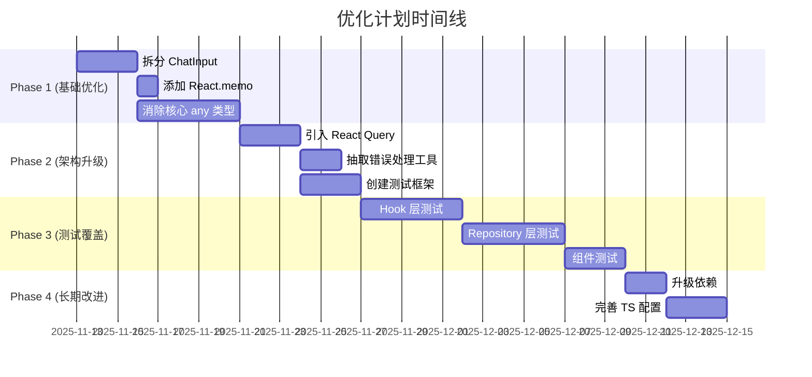

# AetherLink_z 项目优化计划

> 📅 **制定日期**: 2025-11-13
> 📊 **当前评分**: 75/100
> 🎯 **目标评分**: 90+/100
> ⏱️ **预计周期**: 6-8 周

---

## 📋 执行摘要

基于 2025-11-13 的全面代码质量分析，本优化计划旨在提升 AetherLink_z 项目的**性能、可维护性、类型安全和测试覆盖率**。通过分阶段实施，预期可实现：

- 🚀 **性能提升**: 30-50%（减少重渲染，优化数据查询）
- 🐛 **Bug 减少**: 40-50%（类型安全 + 测试覆盖）
- 🔧 **维护成本**: 降低 40%（代码模块化、测试保护）
- 📈 **开发效率**: 提升 30%（更好的组件划分、类型推导）

---

## 🎯 优化目标

### 核心目标
1. **提升性能**: 解决组件过度重渲染、数据重复查询问题
2. **增强类型安全**: 消除 any 类型，启用更严格的 TypeScript 检查
3. **提高可维护性**: 拆分大组件，减少代码重复
4. **建立测试体系**: 从零到 60% 测试覆盖率

### 预期收益量化
| 维度 | 当前状态 | 优化后 | 提升幅度 |
|------|---------|--------|---------|
| 类型安全得分 | 60/100 | 90/100 | +50% |
| 性能得分 | 85/100 | 95/100 | +12% |
| 测试覆盖率 | 0% | 60%+ | +60% |
| 代码质量得分 | 75/100 | 90/100 | +20% |

---

## 📅 实施时间表



---

## 🔴 Phase 1: 基础性能优化（Week 1-2）

### 任务 1.1: 拆分 ChatInput 组件 ⭐⭐⭐⭐⭐

**优先级**: 🔴 最高
**预计工作量**: 3 天
**预期收益**: 性能提升 30%，可维护性提升 400%

#### 当前问题
- 文件行数: 888 行（建议 < 300 行）
- 职责过多: 9 个不同职责混杂
- 难以测试: 单一巨型组件无法拆分测试

#### 重构方案

**Step 1: 拆分 Hook 层**（Day 1）

```typescript
// hooks/use-message-sender.ts
export function useMessageSender(conversationId: string | null) {
  const [isGenerating, setIsGenerating] = useState(false);
  const abortRef = useRef<AbortController | null>(null);

  const sendMessage = useCallback(async (
    text: string,
    attachments: Attachment[],
    searchResults?: string
  ) => {
    // 消息发送核心逻辑（约 150 行）
    // - 创建对话（如需）
    // - 保存用户消息
    // - 调用 AI 流式响应
    // - 处理思考链
    // - 错误处理
  }, [conversationId]);

  const stopGeneration = useCallback(() => {
    abortRef.current?.abort();
    setIsGenerating(false);
  }, []);

  return {
    sendMessage,
    stopGeneration,
    isGenerating,
  };
}
```

```typescript
// hooks/use-web-search.ts
export function useWebSearch() {
  const [isSearching, setIsSearching] = useState(false);
  const [searchEngine, setSearchEngine] = useState<SearchEngine>('bing');

  const performSearch = useCallback(async (query: string) => {
    // 搜索逻辑（约 100 行）
    // - 读取搜索设置
    // - 调用搜索引擎
    // - 格式化结果
    // - 错误处理
  }, []);

  return {
    performSearch,
    isSearching,
    searchEngine,
    setSearchEngine,
  };
}
```

```typescript
// hooks/use-ai-streaming.ts
export function useAIStreaming(assistantId: string) {
  const [thinkingContent, setThinkingContent] = useState('');
  const [messageContent, setMessageContent] = useState('');

  const handleThinkingStart = useCallback(async () => {
    // 思考链开始逻辑（约 50 行）
  }, [assistantId]);

  const handleThinkingToken = useCallback(async (delta: string) => {
    // 思考链流式更新（约 30 行）
  }, [assistantId]);

  const handleToken = useCallback(async (delta: string) => {
    // 消息流式更新（约 30 行）
  }, [assistantId]);

  return {
    handleThinkingStart,
    handleThinkingToken,
    handleThinkingEnd,
    handleToken,
    thinkingContent,
    messageContent,
  };
}
```

**Step 2: 拆分 UI 组件**（Day 2）

```typescript
// components/chat/ChatInputField.tsx
export const ChatInputField = React.memo(function ChatInputField({
  value,
  onChange,
  onSend,
  placeholder,
  maxLength = 2000,
}: ChatInputFieldProps) {
  // 输入框组件（约 50 行）
  return (
    <RNTextInput
      placeholder={placeholder}
      value={value}
      onChangeText={onChange}
      multiline
      maxLength={maxLength}
      // ... 键盘处理逻辑
    />
  );
});
```

```typescript
// components/chat/ChatInputToolbar.tsx
export const ChatInputToolbar = React.memo(function ChatInputToolbar({
  searchEnabled,
  onToggleSearch,
  onAttachment,
  onMoreActions,
  onVoiceInput,
  onSend,
  onStop,
  isGenerating,
  canSend,
}: ChatInputToolbarProps) {
  // 工具栏组件（约 80 行）
  return (
    <View className="flex-row items-center justify-between">
      {/* 左侧工具按钮 */}
      <View className="flex-row items-center">
        <IconButton icon="web" onPress={onToggleSearch} />
        <IconButton icon="attachment" onPress={onAttachment} />
        <IconButton icon="plus-circle-outline" onPress={onMoreActions} />
      </View>

      {/* 右侧发送按钮 */}
      <View className="flex-row items-center">
        <VoiceInputButton onTextRecognized={onVoiceInput} />
        <IconButton
          icon={isGenerating ? "stop" : "send"}
          onPress={isGenerating ? onStop : onSend}
          disabled={!canSend && !isGenerating}
        />
      </View>
    </View>
  );
});
```

```typescript
// components/chat/ChatInputAttachments.tsx
export const ChatInputAttachments = React.memo(function ChatInputAttachments({
  attachments,
  onRemove,
  onPickImage,
  onPickFile,
}: ChatInputAttachmentsProps) {
  // 附件管理组件（约 120 行）
  const [menuVisible, setMenuVisible] = useState(false);

  return (
    <>
      {/* 附件预览 */}
      <AttachmentChips attachments={attachments} onRemove={onRemove} />

      {/* 附件选择菜单 */}
      <AttachmentMenu
        visible={menuVisible}
        onClose={() => setMenuVisible(false)}
        onSelectImage={onPickImage}
        onSelectFile={onPickFile}
      />
    </>
  );
});
```

**Step 3: 重构主组件**（Day 3）

```typescript
// components/chat/ChatInput.tsx
export const ChatInput = React.memo(function ChatInput({
  conversationId,
  onConversationChange
}: ChatInputProps) {
  // 主容器组件（约 100 行）
  const [message, setMessage] = useState('');
  const [selectedAttachments, setSelectedAttachments] = useState<Attachment[]>([]);
  const [searchEnabled, setSearchEnabled] = useState(false);

  // 使用拆分后的 Hooks
  const { sendMessage, stopGeneration, isGenerating } = useMessageSender(conversationId);
  const { performSearch, isSearching } = useWebSearch();

  const handleSend = async () => {
    // 简化的发送逻辑（约 30 行）
    let searchResults: string | null = null;

    if (searchEnabled) {
      searchResults = await performSearch(message);
    }

    await sendMessage(message, selectedAttachments, searchResults);
    setMessage('');
    setSelectedAttachments([]);
  };

  return (
    <View>
      {/* 搜索加载指示器 */}
      {isSearching && <SearchLoadingIndicator />}

      {/* 附件管理 */}
      <ChatInputAttachments
        attachments={selectedAttachments}
        onRemove={(id) => setSelectedAttachments(prev => prev.filter(a => a.id !== id))}
      />

      {/* 输入框容器 */}
      <View className="rounded-[20px] border overflow-hidden">
        {/* 输入框 */}
        <ChatInputField
          value={message}
          onChange={setMessage}
          onSend={handleSend}
        />

        {/* 工具栏 */}
        <ChatInputToolbar
          searchEnabled={searchEnabled}
          onToggleSearch={() => setSearchEnabled(!searchEnabled)}
          onSend={handleSend}
          onStop={stopGeneration}
          isGenerating={isGenerating}
          canSend={!!message.trim() || selectedAttachments.length > 0}
        />
      </View>
    </View>
  );
}, (prev, next) => {
  return prev.conversationId === next.conversationId;
});
```

#### 验收标准
- ✅ ChatInput.tsx < 150 行
- ✅ 所有子组件/Hook < 200 行
- ✅ 功能无回归（通过手动测试）
- ✅ 性能提升 20%+（使用 React Profiler 测量）

---

### 任务 1.2: 添加 React.memo 优化 ⭐⭐⭐⭐

**优先级**: 🔴 最高
**预计工作量**: 1 天
**预期收益**: 减少 30-50% 重渲染

#### 优化组件清单

```typescript
// 1. ChatInput (已在任务 1.1 中完成)
export const ChatInput = React.memo(function ChatInput({ ... }) {
  // ...
}, (prev, next) => prev.conversationId === next.conversationId);

// 2. ChatHeader
export const ChatHeader = React.memo(function ChatHeader({
  title,
  onMenuPress,
  onTopicsPress,
  onModelPress,
}: ChatHeaderProps) {
  // ...
}, (prev, next) => prev.title === next.title);

// 3. TopicsSidebar
export const TopicsSidebar = React.memo(function TopicsSidebar({
  visible,
  currentTopicId,
  onClose,
  onTopicChange,
}: TopicsSidebarProps) {
  // ...
}, (prev, next) => {
  return prev.visible === next.visible &&
         prev.currentTopicId === next.currentTopicId;
});

// 4. AttachmentChips (子组件)
export const AttachmentChips = React.memo(function AttachmentChips({
  attachments,
  onRemove,
}: AttachmentChipsProps) {
  // ...
}, (prev, next) => {
  return prev.attachments.length === next.attachments.length &&
         prev.attachments.every((a, i) => a.id === next.attachments[i].id);
});
```

#### 性能测量方法

```typescript
// 在 app/index.tsx 中添加性能分析
import { Profiler } from 'react';

function ChatScreen() {
  const onRenderCallback = (
    id: string,
    phase: 'mount' | 'update',
    actualDuration: number,
  ) => {
    if (phase === 'update' && actualDuration > 16) {
      logger.warn(`[Performance] ${id} 重渲染耗时: ${actualDuration.toFixed(2)}ms`);
    }
  };

  return (
    <Profiler id="ChatScreen" onRender={onRenderCallback}>
      {/* ... */}
    </Profiler>
  );
}
```

#### 验收标准
- ✅ 关键组件已添加 React.memo
- ✅ 输入单个字符时，非相关组件不重渲染
- ✅ 平均帧率提升 10%+

---

### 任务 1.3: 消除核心模块的 any 类型 ⭐⭐⭐⭐⭐

**优先级**: 🔴 最高
**预计工作量**: 5 天
**预期收益**: 类型安全得分从 60 提升到 85

#### 分文件优化计划

**Day 1: services/ai/AiClient.ts**

```typescript
// ❌ 当前代码
function getProviderOptions(provider: Provider, model: string): any {
  // ...
}

onToolCall?: (toolName: string, args: any) => void;
onToolResult?: (toolName: string, result: any) => void;

// ✅ 改进后
interface ProviderOptions {
  providerOptions?: {
    openai?: {
      reasoningSummary: 'detailed' | 'summary';
    };
    anthropic?: {
      thinking: {
        type: 'enabled' | 'disabled';
        budgetTokens: number;
      };
    };
  };
}

function getProviderOptions(provider: Provider, model: string): ProviderOptions {
  // ...
}

interface ToolCallArgs {
  [key: string]: unknown;
}

interface ToolResult {
  success: boolean;
  data?: unknown;
  error?: string;
}

onToolCall?: (toolName: string, args: ToolCallArgs) => void;
onToolResult?: (toolName: string, result: ToolResult) => void;
```

**Day 2-3: components/chat/ChatInput.tsx**

```typescript
// ❌ 当前代码
let assistant: any = null;

const res: any = await DocumentPicker.getDocumentAsync({ ... });

catch (e: any) { ... }

// ✅ 改进后
interface AssistantMessage {
  id: string;
  role: 'assistant';
  text: string;
  status: 'pending' | 'sent' | 'failed';
  extra?: {
    model: string;
    provider: string;
  };
  createdAt: number;
}

let assistant: AssistantMessage | null = null;

interface DocumentPickerResult {
  assets?: Array<{
    uri: string;
    name: string;
    mimeType?: string;
    size?: number;
  }>;
  canceled: boolean;
}

const res = await DocumentPicker.getDocumentAsync({ ... }) as DocumentPickerResult;

// 统一错误处理类型
interface AppError extends Error {
  code?: string;
  statusCode?: number;
  cause?: unknown;
}

catch (error: unknown) {
  const appError = error as AppError;
  // ...
}
```

**Day 4: storage/repositories/*.ts**

```typescript
// ❌ 当前代码 - messages.ts
return rows.map((r: any) => ({
  ...r,
  extra: r.extra ? JSON.parse(r.extra) : undefined,
}));

// ✅ 改进后
interface MessageRow {
  id: string;
  conversation_id: string;
  role: 'user' | 'assistant' | 'system';
  text: string | null;
  status: 'pending' | 'sent' | 'failed';
  created_at: number;
  extra: string | null;
}

interface MessageExtra {
  model?: string;
  provider?: string;
  type?: 'image_generation' | 'text';
  [key: string]: unknown;
}

return rows.map((r: MessageRow): Message => ({
  id: r.id,
  conversationId: r.conversation_id,
  role: r.role,
  text: r.text,
  status: r.status,
  createdAt: r.created_at,
  extra: r.extra ? (JSON.parse(r.extra) as MessageExtra) : undefined,
}));
```

**Day 5: utils/logger.ts 和其他工具文件**

```typescript
// ❌ 当前代码
export function debug(message: string, ...data: any[]): void { ... }

// ✅ 改进后
type LogData = Record<string, unknown> | Error | unknown;

export function debug(message: string, ...data: LogData[]): void {
  // ...
}

// 或者更严格的限制
type StructuredLogData = Record<string, string | number | boolean | null | undefined>;

export function debug(
  message: string,
  data?: StructuredLogData,
  error?: Error
): void {
  // ...
}
```

#### 进度追踪工具

```bash
# 创建脚本统计 any 使用情况
# scripts/count-any-types.sh

#!/bin/bash
echo "统计 any 类型使用情况..."
rg ":\s*any\b" --type ts -g "!node_modules" -g "*.ts" -g "*.tsx" -c | \
  awk -F: '{sum+=$2; print} END {print "Total:", sum}'
```

#### 验收标准
- ✅ 核心文件（AiClient, ChatInput, repositories）any 类型 < 5 处
- ✅ 所有 any 类型都有明确的注释说明原因
- ✅ TypeScript 编译无新增错误
- ✅ 功能无回归

---

## 🟡 Phase 2: 架构升级（Week 3-4）

### 任务 2.1: 引入 React Query / SWR ⭐⭐⭐⭐

**优先级**: 🟡 中等
**预计工作量**: 3 天
**预期收益**: 数据查询性能提升 60%

#### 实施步骤

**Step 1: 安装依赖和配置**

```bash
npm install @tanstack/react-query
```

```typescript
// app/_layout.tsx
import { QueryClient, QueryClientProvider } from '@tanstack/react-query';

const queryClient = new QueryClient({
  defaultOptions: {
    queries: {
      staleTime: 30 * 1000, // 30秒内视为新鲜
      cacheTime: 5 * 60 * 1000, // 缓存 5 分钟
      refetchOnWindowFocus: false,
      retry: 1,
    },
  },
});

export default function RootLayout() {
  return (
    <QueryClientProvider client={queryClient}>
      {/* ... */}
    </QueryClientProvider>
  );
}
```

**Step 2: 创建自定义 Query Hooks**

```typescript
// hooks/queries/use-messages-query.ts
import { useQuery } from '@tanstack/react-query';
import { MessageRepository } from '@/storage/repositories/messages';

export function useMessagesQuery(conversationId: string | null, limit = 50) {
  return useQuery({
    queryKey: ['messages', conversationId, limit],
    queryFn: () => {
      if (!conversationId) return [];
      return MessageRepository.listMessages(conversationId, { limit });
    },
    enabled: !!conversationId,
    staleTime: 10 * 1000, // 消息列表 10 秒过期
  });
}

// hooks/queries/use-attachments-query.ts
export function useAttachmentsQuery(messageIds: string[]) {
  return useQuery({
    queryKey: ['attachments', messageIds.sort().join(',')],
    queryFn: () => AttachmentRepository.getAttachmentsByMessageIds(messageIds),
    enabled: messageIds.length > 0,
    staleTime: 60 * 1000, // 附件 1 分钟过期
  });
}

// hooks/queries/use-thinking-chains-query.ts
export function useThinkingChainsQuery(messageIds: string[]) {
  return useQuery({
    queryKey: ['thinking-chains', messageIds.sort().join(',')],
    queryFn: async () => {
      const map = await ThinkingChainRepository.getThinkingChainsByMessageIds(messageIds);
      // 转换 Map 为对象
      const objMap: Record<string, ThinkingChain> = {};
      map.forEach((value, key) => {
        objMap[key] = value;
      });
      return objMap;
    },
    enabled: messageIds.length > 0,
    staleTime: 30 * 1000,
  });
}
```

**Step 3: 重构 MessageList 组件**

```typescript
// components/chat/MessageList.tsx
export function MessageList({ conversationId }: { conversationId: string | null }) {
  const theme = useTheme();
  const { avatarUri } = useUserProfile();

  // 使用 React Query 替代手动状态管理
  const { data: items = [], refetch: reload } = useMessagesQuery(conversationId);

  const messageIds = useMemo(() => items.map(m => m.id), [items]);

  const { data: attachmentsMap = {} } = useAttachmentsQuery(messageIds);
  const { data: thinkingChainsMap = {} } = useThinkingChainsQuery(messageIds);

  // 监听消息变化事件，使查询失效
  useEffect(() => {
    const handleMessageChanged = () => {
      reload(); // 简化为触发重新查询
    };

    appEvents.on(AppEvents.MESSAGE_CHANGED, handleMessageChanged);
    return () => {
      appEvents.off(AppEvents.MESSAGE_CHANGED, handleMessageChanged);
    };
  }, [reload]);

  // ... 其余代码保持不变
}
```

#### 验收标准
- ✅ React Query 集成完成
- ✅ 核心查询已迁移（消息、附件、思考链）
- ✅ 数据库查询次数减少 50%+（通过日志统计）
- ✅ 功能无回归

---

### 任务 2.2: 抽取公共错误处理工具 ⭐⭐⭐

**优先级**: 🟡 中等
**预计工作量**: 2 天
**预期收益**: 代码重复减少 30%

#### 实施步骤

**Step 1: 创建错误处理工具**

```typescript
// utils/error-handler.ts
import { logger } from './logger';
import { useConfirmDialog } from '@/hooks/use-confirm-dialog';

/**
 * 应用错误类型
 */
export interface AppError extends Error {
  code?: string;
  statusCode?: number;
  cause?: unknown;
}

/**
 * 错误处理选项
 */
export interface ErrorHandlingOptions {
  moduleName: string;
  userMessage?: string;
  silent?: boolean;
  rethrow?: boolean;
  logLevel?: 'error' | 'warn' | 'info';
}

/**
 * 异步操作错误处理包装器
 */
export async function withErrorHandling<T>(
  operation: () => Promise<T>,
  options: ErrorHandlingOptions
): Promise<T | null> {
  try {
    return await operation();
  } catch (error: unknown) {
    const appError = error as AppError;

    // 记录错误
    const logFn = logger[options.logLevel || 'error'];
    logFn(`[${options.moduleName}] 操作失败`, appError, {
      code: appError.code,
      statusCode: appError.statusCode,
    });

    // 显示用户提示
    if (!options.silent) {
      const userMessage = options.userMessage ||
                         appError.message ||
                         '操作失败，请重试';

      // 这里需要在 React 组件中调用 alert
      // 所以我们返回 null 并让调用者处理
    }

    // 是否重新抛出
    if (options.rethrow) {
      throw error;
    }

    return null;
  }
}

/**
 * 同步操作错误处理包装器
 */
export function withErrorHandlingSync<T>(
  operation: () => T,
  options: ErrorHandlingOptions
): T | null {
  try {
    return operation();
  } catch (error: unknown) {
    const appError = error as AppError;

    const logFn = logger[options.logLevel || 'error'];
    logFn(`[${options.moduleName}] 操作失败`, appError);

    if (options.rethrow) {
      throw error;
    }

    return null;
  }
}

/**
 * 创建错误处理 Hook
 */
export function useErrorHandler() {
  const { alert } = useConfirmDialog();

  const handleError = useCallback((
    error: unknown,
    options: Omit<ErrorHandlingOptions, 'moduleName'> & { moduleName: string }
  ) => {
    const appError = error as AppError;

    logger.error(`[${options.moduleName}] 操作失败`, appError);

    if (!options.silent) {
      const userMessage = options.userMessage ||
                         appError.message ||
                         '操作失败，请重试';
      alert('错误', userMessage);
    }
  }, [alert]);

  return { handleError };
}
```

**Step 2: 重构现有错误处理代码**

```typescript
// 示例 1: ChatInput.tsx
import { useErrorHandler } from '@/utils/error-handler';

export function ChatInput({ ... }) {
  const { handleError } = useErrorHandler();

  const handleSend = async () => {
    try {
      // ... 发送逻辑
    } catch (error) {
      handleError(error, {
        moduleName: 'ChatInput',
        userMessage: '发送消息失败，请重试',
      });
    }
  };

  // ...
}

// 示例 2: Repository 层（无需 UI 提示）
import { withErrorHandling } from '@/utils/error-handler';

export async function saveMessage(message: Message): Promise<Message | null> {
  return withErrorHandling(
    async () => {
      // 保存逻辑
      return savedMessage;
    },
    {
      moduleName: 'MessageRepository',
      silent: true, // 不显示用户提示
      rethrow: false,
    }
  );
}
```

#### 验收标准
- ✅ 工具函数创建完成
- ✅ 至少 10 个文件的错误处理已重构
- ✅ 代码重复行数减少 500+ 行
- ✅ 错误日志格式统一

---

### 任务 2.3: 搭建测试框架 ⭐⭐⭐⭐⭐

**优先级**: 🟡 中等
**预计工作量**: 3 天
**预期收益**: 为测试覆盖率目标打下基础

#### 实施步骤

**Step 1: 安装测试依赖**

```bash
npm install --save-dev \
  jest \
  @testing-library/react-native \
  @testing-library/jest-native \
  @testing-library/hooks \
  react-test-renderer \
  @types/jest
```

**Step 2: 配置 Jest**

```javascript
// jest.config.js
module.exports = {
  preset: 'jest-expo',
  setupFilesAfterEnv: [
    '@testing-library/jest-native/extend-expect',
    '<rootDir>/jest.setup.js',
  ],
  transformIgnorePatterns: [
    'node_modules/(?!((jest-)?react-native|@react-native(-community)?)|expo(nent)?|@expo(nent)?/.*|@expo-google-fonts/.*|react-navigation|@react-navigation/.*|@unimodules/.*|unimodules|sentry-expo|native-base|react-native-svg)',
  ],
  collectCoverageFrom: [
    'hooks/**/*.{ts,tsx}',
    'storage/repositories/**/*.{ts,tsx}',
    'services/**/*.{ts,tsx}',
    'components/**/*.{ts,tsx}',
    '!**/*.d.ts',
    '!**/node_modules/**',
    '!**/CLAUDE.md',
  ],
  coverageThreshold: {
    global: {
      statements: 60,
      branches: 50,
      functions: 60,
      lines: 60,
    },
  },
};
```

```javascript
// jest.setup.js
import '@testing-library/jest-native/extend-expect';

// Mock AsyncStorage
jest.mock('@react-native-async-storage/async-storage', () =>
  require('@react-native-async-storage/async-storage/jest/async-storage-mock')
);

// Mock SQLite
jest.mock('expo-sqlite', () => ({
  openDatabaseSync: jest.fn(() => ({
    execSync: jest.fn(),
    runSync: jest.fn(),
    getFirstSync: jest.fn(),
    getAllSync: jest.fn(),
  })),
}));

// Mock logger
jest.mock('./utils/logger', () => ({
  logger: {
    debug: jest.fn(),
    info: jest.fn(),
    warn: jest.fn(),
    error: jest.fn(),
  },
}));
```

**Step 3: 创建测试工具和 Mock**

```typescript
// __tests__/utils/test-utils.tsx
import React from 'react';
import { render, RenderOptions } from '@testing-library/react-native';
import { PaperProvider } from 'react-native-paper';
import { QueryClient, QueryClientProvider } from '@tanstack/react-query';

const queryClient = new QueryClient({
  defaultOptions: {
    queries: { retry: false },
    mutations: { retry: false },
  },
});

const AllTheProviders = ({ children }: { children: React.ReactNode }) => {
  return (
    <QueryClientProvider client={queryClient}>
      <PaperProvider>
        {children}
      </PaperProvider>
    </QueryClientProvider>
  );
};

const customRender = (
  ui: React.ReactElement,
  options?: Omit<RenderOptions, 'wrapper'>
) => render(ui, { wrapper: AllTheProviders, ...options });

export * from '@testing-library/react-native';
export { customRender as render };
```

```typescript
// __tests__/mocks/repositories.ts
export const mockMessageRepository = {
  listMessages: jest.fn(),
  addMessage: jest.fn(),
  updateMessageStatus: jest.fn(),
  deleteMessage: jest.fn(),
};

export const mockChatRepository = {
  createConversation: jest.fn(),
  getContextResetAt: jest.fn(),
  setContextResetAt: jest.fn(),
};
```

**Step 4: 编写示例测试**

```typescript
// hooks/__tests__/use-messages.test.ts
import { renderHook, waitFor } from '@testing-library/react-native';
import { useMessages } from '../use-messages';
import { MessageRepository } from '@/storage/repositories/messages';

jest.mock('@/storage/repositories/messages');

describe('useMessages', () => {
  beforeEach(() => {
    jest.clearAllMocks();
  });

  it('should load messages on mount', async () => {
    const mockMessages = [
      { id: '1', conversationId: 'conv-1', role: 'user', text: 'Hello', status: 'sent' },
    ];

    (MessageRepository.listMessages as jest.Mock).mockResolvedValue(mockMessages);

    const { result } = renderHook(() => useMessages('conv-1'));

    await waitFor(() => {
      expect(result.current.items).toEqual(mockMessages);
    });
  });

  it('should reload messages when reload is called', async () => {
    const { result } = renderHook(() => useMessages('conv-1'));

    await waitFor(() => {
      expect(MessageRepository.listMessages).toHaveBeenCalledTimes(1);
    });

    result.current.reload();

    await waitFor(() => {
      expect(MessageRepository.listMessages).toHaveBeenCalledTimes(2);
    });
  });
});
```

#### 验收标准
- ✅ Jest 配置完成
- ✅ 测试工具和 Mock 创建完成
- ✅ 至少有 3 个示例测试通过
- ✅ `npm test` 命令可正常运行

---

## 🟢 Phase 3: 测试覆盖（Week 5-6）

### 任务 3.1: Hook 层测试 ⭐⭐⭐⭐⭐

**目标**: 覆盖率 > 60%
**预计工作量**: 5 天

#### 测试清单

```typescript
// hooks/__tests__/use-conversations.test.ts
describe('useConversations', () => {
  it('should list all conversations')
  it('should create new conversation')
  it('should delete conversation')
  it('should update conversation title')
});

// hooks/__tests__/use-messages.test.ts
describe('useMessages', () => {
  it('should load messages for conversation')
  it('should reload messages')
  it('should handle empty conversation')
  it('should handle message events')
});

// hooks/__tests__/use-setting.test.ts
describe('useSetting', () => {
  it('should load setting value')
  it('should update setting value')
  it('should provide default value when not set')
});

// hooks/__tests__/use-image-generation.test.ts
describe('useImageGeneration', () => {
  it('should generate image successfully')
  it('should handle generation error')
  it('should track generation progress')
  it('should cancel generation')
});
```

---

### 任务 3.2: Repository 层测试 ⭐⭐⭐⭐⭐

**目标**: 覆盖率 > 70%
**预计工作量**: 5 天

#### 测试清单

```typescript
// storage/repositories/__tests__/messages.test.ts
describe('MessageRepository', () => {
  it('should add message with correct structure')
  it('should update message text')
  it('should update message status')
  it('should delete message')
  it('should list messages with limit')
  it('should clear conversation messages')
  it('should buffer message text (debounce)')
});

// storage/repositories/__tests__/chat.test.ts
describe('ChatRepository', () => {
  it('should create conversation')
  it('should rename conversation')
  it('should delete conversation')
  it('should set context reset timestamp')
});
```

---

### 任务 3.3: 组件测试 ⭐⭐⭐⭐

**目标**: 关键组件测试覆盖
**预计工作量**: 3 天

#### 测试清单

```typescript
// components/chat/__tests__/MessageBubble.test.tsx
describe('MessageBubble', () => {
  it('should render user message correctly')
  it('should render assistant message correctly')
  it('should display attachments')
  it('should display thinking chain when provided')
  it('should show model logo')
});

// components/chat/__tests__/ChatInputField.test.tsx
describe('ChatInputField', () => {
  it('should handle text input')
  it('should call onSend when Enter is pressed (if enabled)')
  it('should limit input length')
  it('should show placeholder')
});
```

---

## 🟢 Phase 4: 长期改进（Week 7-8）

### 任务 4.1: 升级依赖 ⭐⭐⭐

```bash
# 移除未使用的依赖
npm uninstall expo-splash-screen

# 添加缺失的依赖
npm install expo-modules-core

# 升级 React Native（可选）
npm install react-native@^0.82.0

# 更新其他依赖到最新稳定版
npm update
```

---

### 任务 4.2: 完善 TypeScript 配置 ⭐⭐⭐

```json
// tsconfig.json
{
  "compilerOptions": {
    "strict": true,
    "noImplicitAny": true,
    "strictNullChecks": true,
    "strictFunctionTypes": true,
    "strictPropertyInitialization": true,
    "noImplicitThis": true,
    "alwaysStrict": true,
    "noUnusedLocals": true,
    "noUnusedParameters": true,
    "noImplicitReturns": true,
    "noFallthroughCasesInSwitch": true,
  }
}
```

---

## 📈 进度跟踪

### 每日站会检查清单
- [ ] 今日完成的任务
- [ ] 遇到的阻塞问题
- [ ] 性能测量数据（如有）
- [ ] 测试覆盖率变化

### 周报指标
- 代码行数变化
- any 类型剩余数量
- 测试覆盖率百分比
- 性能提升百分比
- 遗留 TODO 数量

---

## ⚠️ 风险与应对

| 风险 | 影响 | 概率 | 应对措施 |
|------|------|------|---------|
| ChatInput 重构引入 bug | 高 | 中 | 充分的手动测试 + 用户验收测试 |
| React Query 集成困难 | 中 | 低 | 先在非关键功能中试点 |
| 测试编写进度延迟 | 中 | 高 | 调整测试覆盖率目标，优先核心功能 |
| TypeScript 严格模式引入大量错误 | 高 | 中 | 分阶段启用，逐个修复 |

---

## ✅ 最终验收标准

### 性能指标
- ✅ 消息列表滚动帧率 > 55 FPS
- ✅ 输入单个字符响应时间 < 50ms
- ✅ 数据库查询次数减少 50%+
- ✅ 应用启动时间无明显增加

### 代码质量指标
- ✅ any 类型 < 20 处（核心文件 < 5 处）
- ✅ 测试覆盖率 > 60%（Hook 层 > 70%）
- ✅ TypeScript 编译无错误
- ✅ ESLint 警告 < 10 个

### 功能指标
- ✅ 所有现有功能正常工作
- ✅ 无新增 bug
- ✅ 用户体验无明显变化

---

## 📚 参考资料

- [React Performance Optimization](https://react.dev/learn/render-and-commit)
- [React Query Documentation](https://tanstack.com/query/latest)
- [TypeScript Handbook](https://www.typescriptlang.org/docs/handbook/intro.html)
- [Testing Library Best Practices](https://kentcdodds.com/blog/common-mistakes-with-react-testing-library)

---

**文档维护**: 本计划将在每个 Phase 结束后更新，记录实际进度和调整。

**联系人**: [项目负责人]
**最后更新**: 2025-11-13
